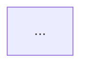

# Contributing to the form0 documentation

Thanks for helping make form0 easier to understand and use. Contributions can be as small as a
typo correction or as broad as a new, fully localized documentation section.

This repository follows the shared form0 contribution conventions, with additional requirements
to keep the English, Spanish, French, and Italian documentation aligned.

## Ways to help

- Correct inaccurate, unclear, or outdated documentation.
- Improve Spanish, French, or Italian translations.
- Add focused examples that reflect supported form0 behavior.
- Fix broken links, navigation, accessibility, or presentation issues.
- Improve the documentation build and validation tooling.

Small, focused fixes can be submitted directly. For a new section, substantial reorganization, or
a change to shared terminology, open an issue first so the approach can be agreed before work is
duplicated.

## Local setup

You need Node.js 24 and npm 10 or later.

```bash
git clone https://github.com/paqu-io/form0-docs-zudoku.git
cd form0-docs-zudoku
npm ci
npm run dev
```

The development site is available at [http://localhost:3000](http://localhost:3000).

## Documentation structure

English pages live directly under `pages/` and are the structural reference. Localized pages use
the same relative path under:

- `pages/es/` for Spanish;
- `pages/fr/` for French; and
- `pages/it/` for Italian.

Shared navigation is defined in `src/navigation/navigation-definition.js`. Navigation labels and
localized interface text live in `src/navigation/navigation-labels.js` and `src/locales/`.

Page badge assignments are centralized in `src/navigation/page-badges.js`. Do not hardcode badge
labels independently in individual translations.

## Content and localization conventions

When changing an English page, update its Spanish, French, and Italian counterparts in the same
pull request. A translation-only correction may update one locale without changing English.

Keep localized pages structurally aligned with English:

- Preserve the heading hierarchy and section order.
- Preserve fenced code, inline technical literals, MDX components, tables, and link destinations.
- Translate prose, headings, titles, descriptions, callouts, and explanatory table content.
- Keep commands, package names, API names, schema attributes, and code examples unchanged unless
  the English technical content is also changing.
- Include exactly one `<PageBadges />` component below the page introduction where required by the
  existing page pattern.
- Always write `form0` and `reform` in lowercase.
- Do not mark a page as translated while placeholder or untranslated English prose remains.

The parity validator enforces the mechanical parts of this contract. Reviewers still need to
assess whether a translation is accurate, natural, and complete.

## Translation glossary

Use these terms in every localized page, including titles, descriptions, and navigation labels.
When a recurring term is not listed, follow the reviewed pages and propose adding it here.

These rules apply to prose. Inline code such as `schema` or `load-record` stays unchanged.

Quote CLI interface text, such as menu choices and messages, as the CLI shows it in that language.
Take the wording from `src/locales/<locale>.json` in the `form0-cli` repository. Commands and
prompts such as `form0(server)>` stay unchanged.

### Translated terms

| English    | Spanish    | French         | Italian |
| ---------- | ---------- | -------------- | ------- |
| schema     | esquema    | schéma         | schema  |
| form       | formulario | formulaire     | modulo  |
| field      | campo      | champ          | campo   |
| record     | registro   | enregistrement | record  |
| submission | envío      | soumission     | invio   |

Italian keeps "record" (il record, i record), as is usual in Italian technical writing.

### Terms kept in English

renderer, binding, host, starter, snapshot, worker, builtin.

- Use them as masculine nouns in all three languages.
- In Spanish and French, add `-s` for the plural (los renderers, les bindings). In Italian, the
  plural does not change (i renderer, i binding).
- Used as modifiers, they follow the noun: la aplicación host, l’application host, l’applicazione
  host; aplicaciones starter, applications starter, app starter.
- Do not replace them with a native equivalent: write renderers, not renderizadores or rendus;
  builtins, not funciones integradas.
- Translate the adjective "built-in" when it describes another noun: built-in renderers becomes
  renderers integrados, renderers intégrés, and renderer integrati.

## Diagrams

Diagrams are hand-written SVG React components, so they are prerendered into the HTML, follow the
site theme, and use translated labels. Each diagram also has a Mermaid version that exists only for
the published Markdown (`.md` pages, `llms-full.txt`, and "Copy page"), where the SVG would appear
as an opaque component tag.

A diagram is made of:

- **The SVG component** in `src/components/diagrams/`, registered by name in
  `src/components/engine-diagram.jsx`. Shared colors and arrow markers live in
  `src/components/diagrams/diagram-style.jsx`.
- **Its labels** in `src/locales/<locale>/docs.json` under `diagrams.<diagramKey>`, including the
  `ariaLabel` and `caption`.
- **The Mermaid fence** inside the `<EngineDiagram>` element on the page. The component never
  renders it.

````mdx
<EngineDiagram name="evaluation-cycle">



</EngineDiagram>
````

The SVG and the Mermaid fence describe the same diagram and must change together:

- When you change a diagram's boxes, arrows, or labels, update the Mermaid fence to match.
- The Mermaid fence is fenced code, so it stays in English and must be byte-identical in all four
  locales. Copy the updated fence into `pages/es/`, `pages/fr/`, and `pages/it/`; the parity
  validator fails if one locale differs.
- Translate the SVG labels in `docs.json` for every locale. Step boxes have fixed widths, so keep
  translated labels short and check the rendered diagram in each language.
- Nothing checks that the SVG and the Mermaid say the same thing. Reviewers should compare them.

## Writing style

- Lead with the task or outcome the reader is trying to achieve.
- Prefer direct language, short paragraphs, and concrete examples.
- Introduce terminology before relying on it.
- Do not document planned or speculative behavior as available.
- Link to the owning form0 repository when implementation details matter.
- Use sentence case for headings.

Technical statements should match the current released package or repository behavior. When a
change depends on an unreleased implementation, link the corresponding pull request and coordinate
the documentation publication with that release.

## Generated files

Do not edit build output under `dist/` or the generated Pagefind output under `public/pagefind/`.
Page metadata is generated by the repository scripts; update the relevant source page or generator
rather than editing generated output by hand.

## Run the checks

Before opening a pull request, run:

```bash
npm run check
npm run security:audit:prod
```

`npm run check` formats nothing automatically. If it reports formatting differences, run
`npm run format`, review the result, and run the complete check again.

## Commits and pull requests

Use [Conventional Commits](https://www.conventionalcommits.org/) with a scope when useful:

```text
docs(core): clarify calculated field evaluation
docs(i18n): improve the Italian quickstart
fix(navigation): correct the connector link
```

Keep each pull request focused. Explain what changed and why, link any related issue, list the
checks you ran, and identify which languages were affected. Include screenshots for layout,
navigation, theme, or component changes.

Maintainers normally squash a pull request into one commit, so use a clear pull request title that
can serve as the final commit message.

## Security

Do not open a public issue for a suspected vulnerability. Follow [SECURITY.md](./SECURITY.md) and
use the repository's private vulnerability-reporting link.

## License

By contributing, you agree that your contributions are licensed under the [MIT License](./LICENSE).
