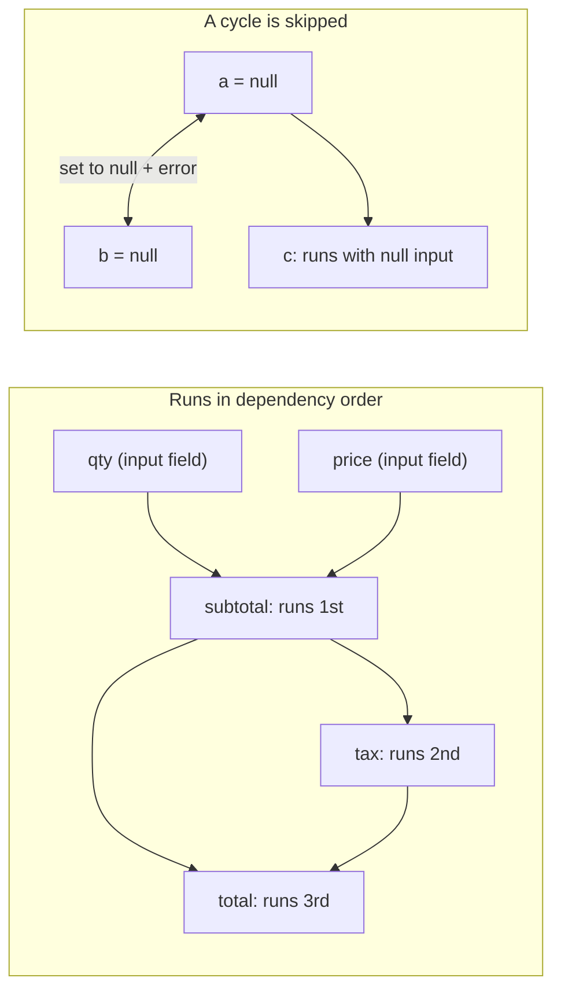

<PageBadges />

import { Callout } from "zudoku/ui/Callout"

Every `CalculatedField` has a `calculate` expression. Calculations are the first step of every
[evaluation pass](/core/engine/evaluation-cycle), so conditions and validation always see
up-to-date calculated values. This page explains the order calculations run in and what happens when
an expression cannot produce a value.

## Referencing fields

Inside an expression, `$data_name` reads the current value of a field. Expressions reference fields
by `data_name`, while conditions use `field_id`.

Values keep the shape the engine stores. A `NumericField` gives you a number, but a choice field gives
you an object with the selected choices. Use builtins such as
[`CHOICEVALUE`](/core/builtins/calculations-expressions/choicevalue) and
[`CHOICELABEL`](/core/builtins/calculations-expressions/choicelabel) to read choice fields.

An expression is JavaScript. For logic that does not fit on one line, write multi-line code and
return the result with [`SETRESULT`](/core/builtins/calculations-expressions/setresult).

## Dependency order

When you create an engine, it reads every `calculate` expression once and notes which `$fields` each
one references. During evaluation, a calculated field always runs after the calculated fields it
depends on. The order of fields in the schema does not matter.

For example, these fields are declared in reverse order:

| Field (schema order) | `calculate`        |
| -------------------- | ------------------ |
| `total`              | `$subtotal + $tax` |
| `tax`                | `$subtotal * 0.2`  |
| `subtotal`           | `$qty * $price`    |

With `qty` set to 2 and `price` set to 10, the engine runs `subtotal` first (20), then `tax` (4),
then `total` (24). One pass is enough, however long the chain is.

<EngineDiagram name="calculation-order">



</EngineDiagram>

## Cycles

A cycle happens when calculated fields depend on each other in a loop, either directly (`a` uses
`$a`) or through other fields (`a` uses `$b` and `b` uses `$a`). The engine cannot order these
fields, so it:

- sets every field in the cycle to `null`;
- emits a dependency diagnostic through `WarningSystem` that names the cycle, such as
  `CalculatedField dependency cycle detected: a -> b`; and
- still calculates every other field.

The cycle diagnostic is not added to the form state's value-validation `errors` map.

A field that references a field in the cycle still runs, with `null` as the input. In JavaScript,
`null * 2` is `0`, so `c` with `$a * 2` shows `0` rather than `null`.

A cycle does not make the schema invalid, so creating the engine succeeds. The diagnostic appears
when the form is evaluated. To fix it, break the loop, for example by turning one of the fields into
an input field.

## When an expression fails

If an expression throws, for example because it calls a method on `null`, that calculated field is
set to `null` for this pass. The remaining calculated fields still run; a field that depends on the
failed field receives `null` and may produce another value or fail in turn.

If an expression references a field that does not exist in the schema, the engine also reports a
warning that names the field. In the `SAFE` [security mode](/core/security), an expression that uses
something the mode does not allow is rejected and the field is set to `null`.

## Dynamic references with EVAL()

[`EVAL`](/core/builtins/calculations-expressions/eval) reads a field whose name is given as a
string. How the engine orders it depends on that string:

- **A fixed name**, such as `EVAL('$price')`, is treated like `$price` and ordered normally.
- **A name built at runtime**, such as `EVAL('$' + $unit + '_price')`, cannot be known in advance.

When any calculated field uses a name built at runtime, the engine can no longer guarantee the order.
It then runs all calculated fields repeatedly until no value changes, up to one pass per calculated
field (at least two). If values are still changing after the last pass, it reports a warning that
names those fields. It also reports a warning for each field that uses a runtime-built name.

<Callout type="tip" title="Prefer direct references">
  Write `$price` instead of `EVAL('$price')` whenever the field name is known. Direct references
  keep the single ordered pass and make dependencies visible to anyone reading the schema.
</Callout>

## Seeing errors and warnings

While it runs calculations, the engine records each problem it finds as a **diagnostic**: a cycle,
a reference to a missing field, an expression that throws, and so on. Diagnostics are separate from
`state.errors`. They never make a submission invalid.

### Reading diagnostics

Call `engine.getDiagnostics()` after `eval()`. It returns the diagnostics from the latest
evaluation, or `[]` before the first one:

```js
const engine = createFormEngine({ schema })
engine.eval()

for (const diagnostic of engine.getDiagnostics()) {
  console.log(diagnostic.code, diagnostic.fieldName, diagnostic.message)
}
```

Each `eval()` replaces the list instead of adding to it, so a problem disappears as soon as its cause
is fixed. Suppose `quotient` has this `calculate` expression:

```js
if ($divisor === 0) {
  throw new Error("Divisor cannot be zero")
}
SETRESULT($numerator / $divisor)
```

```js
engine.getState().values.divisor = 0
engine.eval()
engine.getDiagnostics() // [{ code: "runtime_exception", fieldName: "quotient", ... }]

engine.getState().values.divisor = 4
engine.eval()
engine.getDiagnostics() // []
```

Within one evaluation, the same problem is reported only once, even when the engine runs the
calculation in several passes. A failure in an early pass is still reported if a later pass of the
same evaluation succeeds.

A calculation that returns `null`, `undefined`, `NaN`, or `Infinity` is not an error. Without the
`throw`, `$numerator / 0` returns `Infinity` and produces no diagnostic.

`getDiagnostics()` returns a copy, so changing the array does not affect the engine.

### Reacting to every evaluation

To receive diagnostics without calling `getDiagnostics()`, pass `onDiagnostics` when you create the
engine. The engine calls it once after every `eval()`, even when the list is empty or unchanged:

```js
const engine = createFormEngine({
  schema,
  onDiagnostics(diagnostics) {
    showCalculationProblems(diagnostics) // your own function
  },
})
```

If `onDiagnostics` throws or returns a rejected promise, the evaluation still completes.

### What a diagnostic contains

| Property     | Description                                                                           |
| ------------ | ------------------------------------------------------------------------------------- |
| `code`       | One of the codes below.                                                               |
| `severity`   | `error` or `warning`.                                                                 |
| `message`    | A readable description of the problem.                                                |
| `fieldName`  | The `data_name` of the calculated field.                                              |
| `phase`      | Where the problem occurred: `dependency`, `scope`, `validation`, `syntax`, `runtime`. |
| `suggestion` | A hint for fixing the problem, or `null` when there is none.                          |
| `context`    | Extra details, always JSON-serializable.                                              |

`context` always has `source`, which is `expression` for the calculation itself or `EVAL` for an
`EVAL()` call inside it, and `parentPath`, the keys of the RepeatableSections that contain the
field. Depending on the code, it also has `referencedFieldName`, `fieldNames` (the fields involved),
or `maxPasses`.

The engine does not add the expression source, field values, or stack traces to a diagnostic.
`message` can still contain the text of an error your expression throws.

### Diagnostic codes

Codes are stable, so your application can rely on them.

| Code                           | Severity | Phase      | Meaning                                                                        |
| ------------------------------ | -------- | ---------- | ------------------------------------------------------------------------------ |
| `dynamic_dependencies`         | warning  | dependency | The field builds an `EVAL()` name at runtime, so the engine runs extra passes. |
| `cyclic_dependencies`          | error    | dependency | The field is part of a [cycle](#cycles) and was set to `null`.                 |
| `non_converging_runtime`       | warning  | dependency | Values were still changing after the last pass (`maxPasses`).                  |
| `missing_reference`            | warning  | scope      | The expression references a field that is not in the schema.                   |
| `restricted_reference`         | warning  | scope      | The expression references a field outside its scope.                           |
| `expression_validation_failed` | error    | validation | The [security mode](/core/security) or a builtin rejected the expression.      |
| `invalid_syntax`               | error    | syntax     | The expression has invalid syntax.                                             |
| `compilation_error`            | error    | syntax     | The expression could not be compiled, for example because of a CSP rule.       |
| `runtime_exception`            | error    | runtime    | The expression threw an error, including a `SyntaxError` it threw itself.      |
| `missing_result`               | warning  | runtime    | A multiline expression did not call `SETRESULT()`, so the field has no value.  |
| `eval_invalid_argument`        | error    | validation | `EVAL()` received something other than a non-empty string.                     |
| `eval_reference_unavailable`   | error    | scope      | `EVAL()` could not find the field it was asked to read.                        |

### Console output

By default, the engine also prints problems to the console:

- Dependency and scope warnings print only in development. Node.js counts as development unless
  `NODE_ENV` is `production`. In a browser, pages on `localhost`, `127.0.0.1`, or a URL with an
  explicit port count as development.
- Expression and `EVAL()` failures print in every environment.

To choose for yourself, set `diagnostics.console`:

- `console: false` prints nothing about calculations, including `EVAL()` debug messages. Use it
  when you show diagnostics in your own interface.
- `console: true` prints every diagnostic, in development and in production.

```js
const engine = createFormEngine({ schema, diagnostics: { console: false } })
```

If you pass your own `WarningSystem`, its handlers still receive dependency and scope warnings.

### Migrating from `runtimeDiagnostics`

The `runtimeDiagnostics` option, an array the engine appends to, is deprecated but still supported.
Instead, call `engine.getDiagnostics()` after `eval()`, or pass `onDiagnostics` to be notified after
every evaluation, including with an empty list once problems are fixed.

The new API is not a drop-in replacement. Diagnostics have the shape described in [What a diagnostic
contains](#what-a-diagnostic-contains), and each evaluation replaces the previous list instead of
adding to it. If you need a history, keep earlier lists in your application. No removal date has
been set yet.

## Calculated fields in repeatable sections

A calculated field inside a `RepeatableSection` runs once for each row. It can reference main-form
fields, fields in its own row, and fields in the rows that contain it. A reference to a field outside
that scope reads `undefined` and produces a warning. See [Parent and child scopes](/core/engine/parent-child-scopes).
