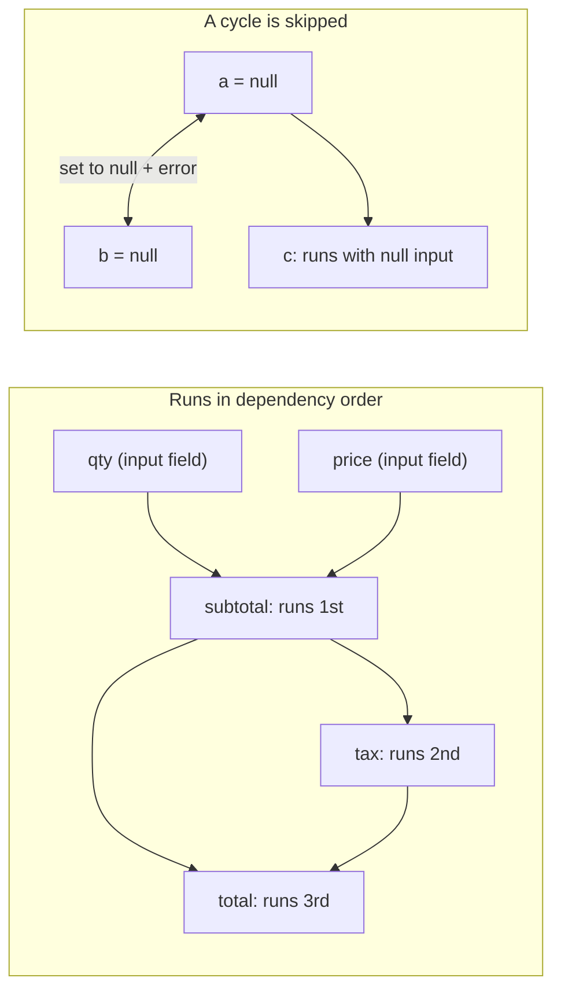

<PageBadges />

import { Callout } from "zudoku/ui/Callout"

Every `CalculatedField` has a `calculate` expression. Calculations are the first step of every
[evaluation pass](/core/engine/evaluation-cycle), so conditions and validation always see
up-to-date calculated values. This page explains the order calculations run in and what happens when
an expression cannot produce a value.

## Referencing fields

Inside an expression, `$data_name` reads the current value of a field. Expressions reference fields
by `data_name`, while conditions use `field_id`.

Values keep the shape the engine stores. A `NumericField` gives you a number, but a choice field gives
you an object with the selected choices. Use builtins such as
[`CHOICEVALUE`](/core/builtins/calculations-expressions/choicevalue) and
[`CHOICELABEL`](/core/builtins/calculations-expressions/choicelabel) to read choice fields.

An expression is JavaScript. For logic that does not fit on one line, write multi-line code and
return the result with [`SETRESULT`](/core/builtins/calculations-expressions/setresult).

## Dependency order

When you create an engine, it reads every `calculate` expression once and notes which `$fields` each
one references. During evaluation, a calculated field always runs after the calculated fields it
depends on. The order of fields in the schema does not matter.

For example, these fields are declared in reverse order:

| Field (schema order) | `calculate`        |
| -------------------- | ------------------ |
| `total`              | `$subtotal + $tax` |
| `tax`                | `$subtotal * 0.2`  |
| `subtotal`           | `$qty * $price`    |

With `qty` set to 2 and `price` set to 10, the engine runs `subtotal` first (20), then `tax` (4),
then `total` (24). One pass is enough, however long the chain is.

<EngineDiagram name="calculation-order">



</EngineDiagram>

## Cycles

A cycle happens when calculated fields depend on each other in a loop, either directly (`a` uses
`$a`) or through other fields (`a` uses `$b` and `b` uses `$a`). The engine cannot order these
fields, so it:

- sets every field in the cycle to `null`;
- emits a dependency diagnostic through `WarningSystem` that names the cycle, such as
  `CalculatedField dependency cycle detected: a -> b`; and
- still calculates every other field.

The cycle diagnostic is not added to the form state's value-validation `errors` map.

A field that references a field in the cycle still runs, with `null` as the input. In JavaScript,
`null * 2` is `0`, so `c` with `$a * 2` shows `0` rather than `null`.

A cycle does not make the schema invalid, so creating the engine succeeds. The diagnostic appears
when the form is evaluated. To fix it, break the loop, for example by turning one of the fields into
an input field.

## When an expression fails

If an expression throws, for example because it calls a method on `null`, that calculated field is
set to `null` for this pass. The remaining calculated fields still run; a field that depends on the
failed field receives `null` and may produce another value or fail in turn.

If an expression references a field that does not exist in the schema, the engine also reports a
warning that names the field. In the `SAFE` [security mode](/core/security), an expression that uses
something the mode does not allow is rejected and the field is set to `null`.

## Dynamic references with EVAL()

[`EVAL`](/core/builtins/calculations-expressions/eval) reads a field whose name is given as a
string. How the engine orders it depends on that string:

- **A fixed name**, such as `EVAL('$price')`, is treated like `$price` and ordered normally.
- **A name built at runtime**, such as `EVAL('$' + $unit + '_price')`, cannot be known in advance.

When any calculated field uses a name built at runtime, the engine can no longer guarantee the order.
It then runs all calculated fields repeatedly until no value changes, up to one pass per calculated
field (at least two). If values are still changing after the last pass, it reports a warning that
names those fields. It also reports a warning for each field that uses a runtime-built name.

<Callout type="tip" title="Prefer direct references">
  Write `$price` instead of `EVAL('$price')` whenever the field name is known. Direct references
  keep the single ordered pass and make dependencies visible to anyone reading the schema.
</Callout>

## Seeing errors and warnings

The engine reports cycles, runtime-built `EVAL()` names, values that do not settle, and references
to missing fields as warnings. In development, it prints them to the console. Node.js counts as
development unless `NODE_ENV` is `production`. In a browser, pages on `localhost`, `127.0.0.1`, or a
URL with an explicit port count as development.

To collect these warnings in your application, pass your own `WarningSystem`:

```js
import { createFormEngine, WarningSystem } from "form0-core"

const warningSystem = new WarningSystem({ enableCollection: true })
const engine = createFormEngine({ schema, warningSystem })
engine.eval()

for (const warning of warningSystem.getCollectedWarnings()) {
  console.log(warning.message, warning.suggestion)
}
```

You can also register a callback with `warningSystem.addWarningHandler(handler)`. The same warning
repeated within a second is reported once.

An expression that throws is not a warning. The engine prints it to the console as
`[form0] Expression evaluation failed`, in every environment, and sets the field to `null`.

## Calculated fields in repeatable sections

A calculated field inside a `RepeatableSection` runs once for each row. It can reference main-form
fields, fields in its own row, and fields in the rows that contain it. A reference to a field outside
that scope reads `undefined` and produces a warning.
