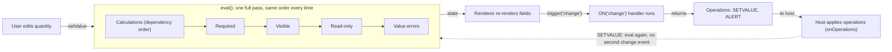

<PageBadges />

import { Callout } from "zudoku/ui/Callout"

The engine does not track which fields a change affects. Whenever something changes, it runs one
full evaluation pass over the whole form, always in the same order. Knowing that order explains
most of what you see at runtime: why a calculated field can drive visibility, why a hidden field
still counts in a calculation, and when event handlers run.

## Creating an engine

`createFormEngine({ schema, initialValues })` prepares the form once. It:

1. Validates the schema and throws if it is invalid. See [Schema validation](/core/schema/validation).
2. Fills in values: the `initialValues` you pass, then each field's `default_value` for everything
   else.
3. Works out which calculated fields depend on which other fields. This happens once, not on every
   evaluation.
4. Runs `form.events.code` once to register event handlers. No event is dispatched at this point.

Creating an engine does not evaluate the form. Visibility, requiredness, and errors stay empty until
the first `engine.eval()`. The official bindings call it immediately after creating the engine.

## One evaluation pass

`engine.eval()` runs these steps in order, every time:

<EngineDiagram name="evaluation-cycle">



</EngineDiagram>

| Step            | What happens                                                                           | Result in state |
| --------------- | -------------------------------------------------------------------------------------- | --------------- |
| 1. Calculations | Every `CalculatedField` runs its `calculate` expression, dependencies first            | `values`        |
| 2. Required     | `required_conditions` is checked, or the static `required` flag is used                | `required`      |
| 3. Visibility   | `visible_conditions` is checked, or the static `visible` flag is used                  | `visible`       |
| 4. Read-only    | `read_only_conditions` is checked, or the static `read_only` flag is used              | `read_only`     |
| 5. Validation   | Each field's value is checked against its own rules, such as `pattern` or number range | `errors`        |

After the pass, `engine.getState()` returns the result. The same values always produce the same
state, no matter in which order the user entered them.

`eval()` also collects calculation diagnostics, such as cycles or expressions that throw. Read them
with `engine.getDiagnostics()`. They do not change `errors`, conditions, or events. See
[Seeing errors and warnings](/core/engine/calculations-dependencies#seeing-errors-and-warnings).

### What the order means for your schema

- **Conditions see calculated values.** Calculations run first, so a `visible_conditions` or
  `required_conditions` can reference a `CalculatedField` and always gets its current value.
- **Calculations ignore visibility.** Hiding a field does not clear its value. A hidden field's
  value is still in `values` and still counts in any calculation that references it.
- **Validation covers every field.** Value errors are computed for hidden fields too. An empty
  required field is not an error in `errors`; the renderer or your application decides whether it
  blocks submission. See [Required fields and submission](/core/schema/validation).
- **Choice conditions compare selected values.** A condition on a choice field compares the selected
  choice `value`, not the whole stored object. See
  [Conditions and operators](/core/schema/conditions-operators).

### Sections follow their children

Visibility is evaluated from the innermost fields outward. A `Section` or `RepeatableSection` whose
children are all hidden is hidden too, whatever its own `visible` or `visible_conditions` say. If at
least one child is visible, the section's own settings apply.

## When a value changes

The engine has no separate "update" step. When a user edits a field, the official bindings:

1. Write the new value into the engine's values.
2. Run `engine.eval()`, which repeats the full pass above.
3. Publish the new state to the UI.
4. Dispatch `change` for the edited field, which runs any matching `ON("change", ...)` handler.

Event handlers never change the form themselves. They return a list of operations, such as
`SETVALUE` or `ALERT`, and the host applies them. When the host applies a `SETVALUE`, it writes the
value and runs `eval()` again, but it does not dispatch another `change` event. A handler therefore
cannot start a chain of change events by setting other fields.

<Callout type="info" title="Event support in the bindings">
  form0-core defines a broader event vocabulary, including record, field, and repeatable-section
  events. The official renderers currently dispatch the portable lifecycle events `load-record`,
  `edit-record`, and `change`. Other events are not dispatched automatically because their timing
  depends on the host application's workflow and UI. Applications can dispatch them explicitly with
  `engine.trigger(...)`. Additional automatic dispatch may be considered individually, but schemas
  should rely only on events documented by their host or binding. See [Event dispatch in official
  bindings](/core/builtins/events-overview).
</Callout>

## Using the engine without a renderer

If you drive the engine yourself, follow the same sequence the bindings use:

```js
import { createFormEngine } from "form0-core"

const engine = createFormEngine({ schema, initialValues: { quantity: 2 } })
engine.eval()

// When the user changes a value:
engine.getState().values.quantity = 3
engine.eval()

// Then dispatch the change event and apply the operations it returns.
const operations = engine.trigger("change", "quantity")
```

<Callout type="caution" title="Choice fields use runtime value shapes">
  `initialValues` and direct writes to `engine.getState().values` must use the engine's live value
  shape. For example, a `SingleChoiceField` or `BooleanField` uses
  `{ "choice": [{ "value": "it", "label": "Italy" }], "other": [] }`, while a
  `MultiChoiceField` uses `choices` instead of `choice`. This differs from a choice field's scalar or
  array `default_value` in the schema. Official renderer field components produce these live shapes;
  form0-core does not currently provide a public value-setting and normalization method.
</Callout>

Your application is responsible for applying the returned operations and for deciding when an
empty required field blocks submission.
