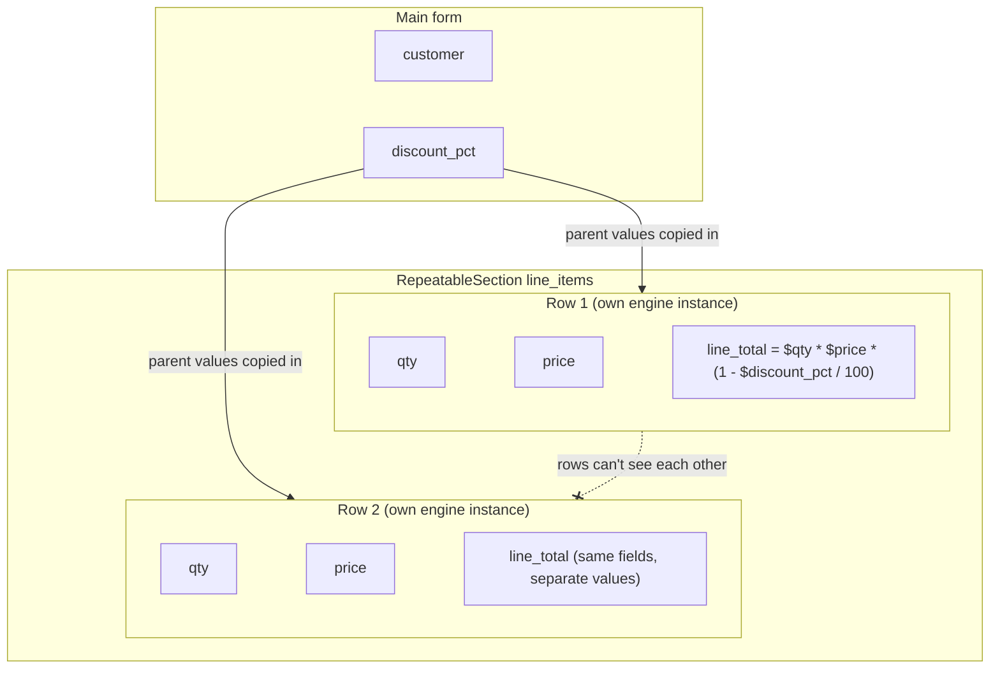

<PageBadges />

A `RepeatableSection` lets a user add any number of rows, such as the line items of an order. Each
row holds its own values for the same set of fields. This page explains how rows are evaluated and
which fields an expression can read from the main form and from a row.

## How rows are evaluated

In the official React and React Native renderers, the main form is evaluated by one engine. Each row
is evaluated in a separate engine instance when it is opened. The row engine uses the same schema
and starts with a copy of the values of everything that contains it, plus the row's own values:

- a row in a top-level `RepeatableSection` gets the main-form values;
- a row in a nested `RepeatableSection` also gets the values of the row that contains it.

Each row then has its own `values`, `visible`, `required`, `read_only`, and `errors`. Two rows never
share state, even though they use the same fields.

If you use `form0-core` without an official renderer, core does not create row engines for you. Your
application is responsible for creating an engine for each row evaluation and supplying the relevant
main-form, ancestor-row, and current-row values.

<EngineDiagram name="repeatable-scope">

</EngineDiagram>

## What an expression can read

Where an expression is defined decides which fields it can read:

| Defined on                 | Main-form fields | Fields in the same row | Fields in rows that contain it | Fields in other rows |
| -------------------------- | ---------------- | ---------------------- | ------------------------------ | -------------------- |
| A main-form field          | Yes              | Not applicable         | Not applicable                 | No                   |
| A field in a top-level row | Yes              | Yes                    | Not applicable                 | No                   |
| A field in a nested row    | Yes              | Yes                    | Yes                            | No                   |

In the order example, `line_total` in each row can use `$discount_pct` from the main form, and
`$qty` and `$price` from its own row. A main-form calculated field cannot read `$line_total`
directly, because each row has its own value.

Calculations and field-event handlers follow these access rules. A calculation reference outside the
allowed fields reads `undefined`, and the engine reports a warning such as
`Field 'line_total' is not accessible from current context`.

Conditions are evaluated against the values available in the current engine. In an official row
editor, that includes the main form, ancestor rows, and the current row. Conditions should not
reference fields from another repeatable branch. Core does not currently report an out-of-scope
warning for condition references.

## Parent values are a copy

A row reads the parent values that were copied into its engine. The official renderers copy the
current parent values each time a row is opened. Changing a parent value later does not recalculate
the other rows: each keeps the calculated values from when it was last evaluated, until it is opened
again.

## Events and rows

The official renderers dispatch `load-record`, `edit-record`, and `change` only for the main record.
Opening or editing a row does not dispatch any event, so it does not run main-record handlers again.

form0-core recognizes repeatable lifecycle event names such as `new-repeatable` and
`save-repeatable`, but the official bindings do not yet define their portable timing, row metadata,
or instance-aware scope. An application dispatching them directly must currently define that
contract itself. See [Event dispatch in official bindings](/core/builtins/events-overview).

Record events, such as `load-record`, can read only main-form fields. Field events, such as
`change`, follow the same rules as a calculation defined on the field that triggered them.

## Rows in the output record

When the form is submitted, each row becomes a child record of the main record. See
[Output and records](/core/output-records).
