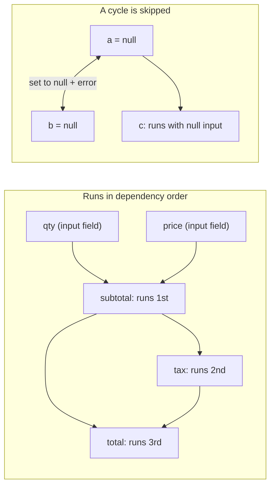

<PageBadges />

import { Callout } from "zudoku/ui/Callout"

Cada `CalculatedField` tiene una expresión `calculate`. Los cálculos son el primer paso de cada
[pasada de evaluación](/es/core/engine/evaluation-cycle), así que las condiciones y la validación
siempre ven los valores calculados actualizados. Esta página explica en qué orden se ejecutan los
cálculos y qué ocurre cuando una expresión no puede producir un valor.

## Hacer referencia a campos

Dentro de una expresión, `$data_name` lee el valor actual de un campo. Las expresiones hacen
referencia a los campos por `data_name`, mientras que las condiciones usan `field_id`.

Los valores conservan la forma en que el motor los almacena. Un `NumericField` te da un número, pero
un campo de elección te da un objeto con las opciones seleccionadas. Usa builtins como
[`CHOICEVALUE`](/es/core/builtins/calculations-expressions/choicevalue) y
[`CHOICELABEL`](/es/core/builtins/calculations-expressions/choicelabel) para leer los campos de
elección.

Una expresión es JavaScript. Para lógica que no cabe en una línea, escribe código de varias líneas y
devuelve el resultado con [`SETRESULT`](/es/core/builtins/calculations-expressions/setresult).

## Orden de dependencias

Al crear un motor, este lee una vez cada expresión `calculate` y anota a qué `$fields` hace
referencia. Durante la evaluación, un campo calculado siempre se ejecuta después de los campos
calculados de los que depende. El orden de los campos en el esquema no importa.

Por ejemplo, estos campos están declarados en orden inverso:

| Campo (orden en el esquema) | `calculate`        |
| --------------------------- | ------------------ |
| `total`                     | `$subtotal + $tax` |
| `tax`                       | `$subtotal * 0.2`  |
| `subtotal`                  | `$qty * $price`    |

Con `qty` en 2 y `price` en 10, el motor ejecuta primero `subtotal` (20), después `tax` (4) y
después `total` (24). Basta una sola pasada, por larga que sea la cadena.

<EngineDiagram name="calculation-order">



</EngineDiagram>

## Ciclos

Se produce un ciclo cuando varios campos calculados dependen unos de otros en bucle, ya sea
directamente (`a` usa `$a`) o a través de otros campos (`a` usa `$b` y `b` usa `$a`). El motor no
puede ordenar estos campos, así que:

- asigna `null` a todos los campos del ciclo;
- emite, a través de `WarningSystem`, un diagnóstico de dependencias que nombra el ciclo, por ejemplo
  `CalculatedField dependency cycle detected: a -> b`; y
- sigue calculando todos los demás campos.

El diagnóstico del ciclo no se añade al mapa `errors` de validación de valores del estado del
formulario.

Un campo que hace referencia a un campo del ciclo se sigue ejecutando, con `null` como entrada. En
JavaScript, `null * 2` es `0`, así que `c` con `$a * 2` muestra `0` en lugar de `null`.

Un ciclo no invalida el esquema, así que la creación del motor funciona. El diagnóstico aparece al
evaluar el formulario. Para corregirlo, rompe el bucle, por ejemplo convirtiendo uno de los campos en
un campo de entrada.

## Cuando una expresión falla

Si una expresión lanza un error, por ejemplo porque llama a un método sobre `null`, ese campo
calculado se establece en `null` en esta pasada. El resto de campos calculados se siguen ejecutando;
un campo que depende del campo fallido recibe `null` y puede producir otro valor o fallar a su vez.

Si una expresión hace referencia a un campo que no existe en el esquema, el motor también emite un
aviso con el nombre del campo. En el [modo de seguridad](/es/core/security) `SAFE`, una expresión que
usa algo que el modo no permite se rechaza y el campo se establece en `null`.

## Referencias dinámicas con EVAL()

[`EVAL`](/es/core/builtins/calculations-expressions/eval) lee un campo cuyo nombre se indica como
cadena. Cómo lo ordena el motor depende de esa cadena:

- **Un nombre fijo**, como `EVAL('$price')`, se trata como `$price` y se ordena normalmente.
- **Un nombre construido en tiempo de ejecución**, como `EVAL('$' + $unit + '_price')`, no puede
  conocerse de antemano.

Cuando algún campo calculado usa un nombre construido en tiempo de ejecución, el motor ya no puede
garantizar el orden. Entonces ejecuta todos los campos calculados repetidamente hasta que ningún
valor cambia, con un máximo de una pasada por campo calculado (al menos dos). Si después de la última
pasada algunos valores siguen cambiando, emite un aviso con el nombre de esos campos. También emite
un aviso por cada campo que usa un nombre construido en tiempo de ejecución.

<Callout type="tip" title="Prefiere las referencias directas">
  Escribe `$price` en lugar de `EVAL('$price')` siempre que conozcas el nombre del campo. Las
  referencias directas mantienen una única pasada ordenada y hacen que las dependencias sean
  visibles para cualquiera que lea el esquema.
</Callout>

## Ver errores y avisos

Mientras ejecuta los cálculos, el motor recoge cada problema que encuentra en forma de
**diagnóstico**: un ciclo, una referencia a un campo inexistente, una expresión que lanza un error,
etc. Los diagnósticos son independientes de `state.errors`. Nunca invalidan un envío.

### Leer los diagnósticos

Llama a `engine.getDiagnostics()` después de `eval()`. Devuelve los diagnósticos de la última
evaluación, o `[]` antes de la primera:

```js
const engine = createFormEngine({ schema })
engine.eval()

for (const diagnostic of engine.getDiagnostics()) {
  console.log(diagnostic.code, diagnostic.fieldName, diagnostic.message)
}
```

Cada `eval()` sustituye la lista en lugar de añadir elementos, así que un problema desaparece en
cuanto se corrige su causa. Supongamos que `quotient` tiene esta expresión `calculate`:

```js
if ($divisor === 0) {
  throw new Error("Divisor cannot be zero")
}
SETRESULT($numerator / $divisor)
```

```js
engine.getState().values.divisor = 0
engine.eval()
engine.getDiagnostics() // [{ code: "runtime_exception", fieldName: "quotient", ... }]

engine.getState().values.divisor = 4
engine.eval()
engine.getDiagnostics() // []
```

Dentro de una misma evaluación, cada problema se notifica una sola vez, aunque el motor ejecute el
cálculo en varias pasadas. Un fallo en una de las primeras pasadas se sigue notificando aunque una
pasada posterior de la misma evaluación tenga éxito.

Un cálculo que devuelve `null`, `undefined`, `NaN` o `Infinity` no es un error. Sin el `throw`,
`$numerator / 0` devuelve `Infinity` y no produce ningún diagnóstico.

`getDiagnostics()` devuelve una copia, así que modificar el array no afecta al motor.

### Reaccionar a cada evaluación

Para recibir los diagnósticos sin llamar a `getDiagnostics()`, pasa `onDiagnostics` al crear el
motor. El motor la llama una vez después de cada `eval()`, aunque la lista esté vacía o no haya
cambiado:

```js
const engine = createFormEngine({
  schema,
  onDiagnostics(diagnostics) {
    showCalculationProblems(diagnostics) // your own function
  },
})
```

Si `onDiagnostics` lanza un error o devuelve una promesa rechazada, la evaluación se completa igualmente.

### Contenido de un diagnóstico

| Propiedad    | Descripción                                                                             |
| ------------ | --------------------------------------------------------------------------------------- |
| `code`       | Uno de los códigos de la tabla siguiente.                                               |
| `severity`   | `error` o `warning`.                                                                    |
| `message`    | Una descripción legible del problema.                                                   |
| `fieldName`  | El `data_name` del campo calculado.                                                     |
| `phase`      | Dónde se produjo el problema: `dependency`, `scope`, `validation`, `syntax`, `runtime`. |
| `suggestion` | Una pista para corregir el problema, o `null` si no hay ninguna.                        |
| `context`    | Detalles adicionales, siempre serializables en JSON.                                    |

`context` siempre incluye `source`, que vale `expression` para el propio cálculo o `EVAL` para una
llamada a `EVAL()` dentro de él, y `parentPath`, las claves de las RepeatableSection que contienen
el campo. Según el código, también incluye `referencedFieldName`, `fieldNames` (los campos
implicados) o `maxPasses`.

El motor no añade a un diagnóstico el código fuente de la expresión, los valores de los campos ni
trazas de pila. Aun así, `message` puede contener el texto de un error que lance tu expresión.

### Códigos de diagnóstico

Los códigos son estables, así que tu aplicación puede basarse en ellos.

| Código                         | Severidad | Fase       | Significado                                                                                                    |
| ------------------------------ | --------- | ---------- | -------------------------------------------------------------------------------------------------------------- |
| `dynamic_dependencies`         | warning   | dependency | El campo construye un nombre de `EVAL()` en tiempo de ejecución, así que el motor ejecuta pasadas adicionales. |
| `cyclic_dependencies`          | error     | dependency | El campo forma parte de un [ciclo](#ciclos) y se ha establecido en `null`.                                     |
| `non_converging_runtime`       | warning   | dependency | Algunos valores seguían cambiando después de la última pasada (`maxPasses`).                                   |
| `missing_reference`            | warning   | scope      | La expresión hace referencia a un campo que no está en el esquema.                                             |
| `restricted_reference`         | warning   | scope      | La expresión hace referencia a un campo fuera de su ámbito.                                                    |
| `expression_validation_failed` | error     | validation | El [modo de seguridad](/es/core/security) o un builtin ha rechazado la expresión.                              |
| `invalid_syntax`               | error     | syntax     | La expresión tiene una sintaxis no válida.                                                                     |
| `compilation_error`            | error     | syntax     | No se ha podido compilar la expresión, por ejemplo por una regla de CSP.                                       |
| `runtime_exception`            | error     | runtime    | La expresión ha lanzado un error, incluido un `SyntaxError` lanzado por ella misma.                            |
| `eval_invalid_argument`        | error     | validation | `EVAL()` ha recibido algo que no es una cadena no vacía.                                                       |
| `eval_reference_unavailable`   | error     | scope      | `EVAL()` no ha encontrado el campo que debía leer.                                                             |

### Salida en la consola

De forma predeterminada, el motor también muestra los problemas en la consola:

- Los avisos de dependencias y de ámbito solo se muestran en desarrollo. Node.js se considera en
  desarrollo salvo que `NODE_ENV` sea `production`. En un navegador, se consideran en desarrollo las
  páginas en `localhost`, `127.0.0.1` o una URL con un puerto explícito.
- Los fallos de las expresiones y de `EVAL()` se muestran en cualquier entorno.

Para decidirlo tú, define `diagnostics.console`:

- `console: false` no muestra nada sobre los cálculos, ni siquiera los mensajes de depuración de
  `EVAL()`. Úsalo cuando muestres los diagnósticos en tu propia interfaz.
- `console: true` muestra todos los diagnósticos, tanto en desarrollo como en producción.

```js
const engine = createFormEngine({ schema, diagnostics: { console: false } })
```

Si pasas tu propio `WarningSystem`, sus manejadores siguen recibiendo los avisos de dependencias y
de ámbito.

### Migrar desde `runtimeDiagnostics`

La opción `runtimeDiagnostics`, un array al que el motor va añadiendo elementos, está obsoleta, pero
se sigue admitiendo. En su lugar, llama a `engine.getDiagnostics()` después de `eval()`, o pasa
`onDiagnostics` para que se te notifique después de cada evaluación, también con una lista vacía
cuando los problemas se hayan corregido.

La nueva API no es un reemplazo directo. Los diagnósticos tienen la forma descrita en [Contenido de
un diagnóstico](#contenido-de-un-diagnóstico), y cada evaluación sustituye la lista anterior en
lugar de añadirle elementos. Si necesitas un historial, guarda las listas anteriores en tu
aplicación. Todavía no se ha fijado cuándo se eliminará.

## Campos calculados en secciones repetibles

Un campo calculado dentro de una `RepeatableSection` se ejecuta una vez por cada fila. Puede hacer
referencia a campos del formulario principal, a campos de su propia fila y a campos de las filas que
la contienen. Una referencia a un campo fuera de ese ámbito lee `undefined` y genera un aviso.
Consulta [Ámbitos padre e hijo](/es/core/engine/parent-child-scopes).
