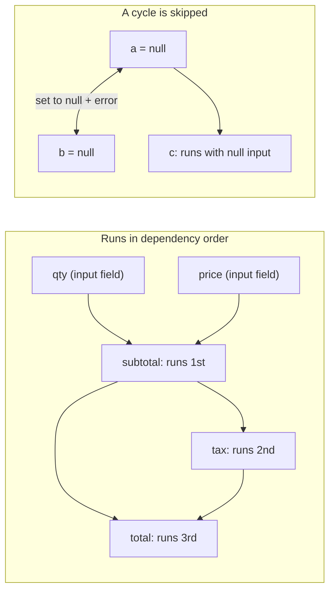

<PageBadges />

import { Callout } from "zudoku/ui/Callout"

Cada `CalculatedField` tiene una expresión `calculate`. Los cálculos son el primer paso de cada
[pasada de evaluación](/es/core/engine/evaluation-cycle), así que las condiciones y la validación
siempre ven los valores calculados actualizados. Esta página explica en qué orden se ejecutan los
cálculos y qué ocurre cuando una expresión no puede producir un valor.

## Hacer referencia a campos

Dentro de una expresión, `$data_name` lee el valor actual de un campo. Las expresiones hacen
referencia a los campos por `data_name`, mientras que las condiciones usan `field_id`.

Los valores conservan la forma en que el motor los almacena. Un `NumericField` te da un número, pero
un campo de elección te da un objeto con las opciones seleccionadas. Usa builtins como
[`CHOICEVALUE`](/es/core/builtins/calculations-expressions/choicevalue) y
[`CHOICELABEL`](/es/core/builtins/calculations-expressions/choicelabel) para leer los campos de
elección.

Una expresión es JavaScript. Para lógica que no cabe en una línea, escribe código de varias líneas y
devuelve el resultado con [`SETRESULT`](/es/core/builtins/calculations-expressions/setresult).

## Orden de dependencias

Al crear un motor, este lee una vez cada expresión `calculate` y anota a qué `$fields` hace
referencia. Durante la evaluación, un campo calculado siempre se ejecuta después de los campos
calculados de los que depende. El orden de los campos en el esquema no importa.

Por ejemplo, estos campos están declarados en orden inverso:

| Campo (orden en el esquema) | `calculate`        |
| --------------------------- | ------------------ |
| `total`                     | `$subtotal + $tax` |
| `tax`                       | `$subtotal * 0.2`  |
| `subtotal`                  | `$qty * $price`    |

Con `qty` en 2 y `price` en 10, el motor ejecuta primero `subtotal` (20), después `tax` (4) y
después `total` (24). Basta una sola pasada, por larga que sea la cadena.

<EngineDiagram name="calculation-order">



</EngineDiagram>

## Ciclos

Se produce un ciclo cuando varios campos calculados dependen unos de otros en bucle, ya sea
directamente (`a` usa `$a`) o a través de otros campos (`a` usa `$b` y `b` usa `$a`). El motor no
puede ordenar estos campos, así que:

- asigna `null` a todos los campos del ciclo;
- emite, a través de `WarningSystem`, un diagnóstico de dependencias que nombra el ciclo, por ejemplo
  `CalculatedField dependency cycle detected: a -> b`; y
- sigue calculando todos los demás campos.

El diagnóstico del ciclo no se añade al mapa `errors` de validación de valores del estado del
formulario.

Un campo que hace referencia a un campo del ciclo se sigue ejecutando, con `null` como entrada. En
JavaScript, `null * 2` es `0`, así que `c` con `$a * 2` muestra `0` en lugar de `null`.

Un ciclo no invalida el esquema, así que la creación del motor funciona. El diagnóstico aparece al
evaluar el formulario. Para corregirlo, rompe el bucle, por ejemplo convirtiendo uno de los campos en
un campo de entrada.

## Cuando una expresión falla

Si una expresión lanza un error, por ejemplo porque llama a un método sobre `null`, ese campo
calculado se establece en `null` en esta pasada. El resto de campos calculados se siguen ejecutando;
un campo que depende del campo fallido recibe `null` y puede producir otro valor o fallar a su vez.

Si una expresión hace referencia a un campo que no existe en el esquema, el motor también emite un
aviso con el nombre del campo. En el [modo de seguridad](/es/core/security) `SAFE`, una expresión que
usa algo que el modo no permite se rechaza y el campo se establece en `null`.

## Referencias dinámicas con EVAL()

[`EVAL`](/es/core/builtins/calculations-expressions/eval) lee un campo cuyo nombre se indica como
cadena. Cómo lo ordena el motor depende de esa cadena:

- **Un nombre fijo**, como `EVAL('$price')`, se trata como `$price` y se ordena normalmente.
- **Un nombre construido en tiempo de ejecución**, como `EVAL('$' + $unit + '_price')`, no puede
  conocerse de antemano.

Cuando algún campo calculado usa un nombre construido en tiempo de ejecución, el motor ya no puede
garantizar el orden. Entonces ejecuta todos los campos calculados repetidamente hasta que ningún
valor cambia, con un máximo de una pasada por campo calculado (al menos dos). Si después de la última
pasada algunos valores siguen cambiando, emite un aviso con el nombre de esos campos. También emite
un aviso por cada campo que usa un nombre construido en tiempo de ejecución.

<Callout type="tip" title="Prefiere las referencias directas">
  Escribe `$price` en lugar de `EVAL('$price')` siempre que conozcas el nombre del campo. Las
  referencias directas mantienen una única pasada ordenada y hacen que las dependencias sean
  visibles para cualquiera que lea el esquema.
</Callout>

## Ver errores y avisos

El motor informa como avisos de los ciclos, los nombres construidos en tiempo de ejecución en
`EVAL()`, los valores que no se estabilizan y las referencias a campos inexistentes. En desarrollo,
los muestra en la consola. Node.js se considera en desarrollo salvo que `NODE_ENV` sea `production`.
En un navegador, se consideran en desarrollo las páginas en `localhost`, `127.0.0.1` o una URL con un
puerto explícito.

Para recopilar estos avisos en tu aplicación, pasa tu propio `WarningSystem`:

```js
import { createFormEngine, WarningSystem } from "form0-core"

const warningSystem = new WarningSystem({ enableCollection: true })
const engine = createFormEngine({ schema, warningSystem })
engine.eval()

for (const warning of warningSystem.getCollectedWarnings()) {
  console.log(warning.message, warning.suggestion)
}
```

También puedes registrar una función de callback con `warningSystem.addWarningHandler(handler)`. Un
mismo aviso repetido en menos de un segundo se notifica una sola vez.

Una expresión que lanza un error no es un aviso. El motor la muestra en la consola como
`[form0] Expression evaluation failed`, en cualquier entorno, y establece el campo en `null`.

## Campos calculados en secciones repetibles

Un campo calculado dentro de una `RepeatableSection` se ejecuta una vez por cada fila. Puede hacer
referencia a campos del formulario principal, a campos de su propia fila y a campos de las filas que
la contienen. Una referencia a un campo fuera de ese ámbito lee `undefined` y genera un aviso.
Consulta [Ámbitos padre e hijo](/es/core/engine/parent-child-scopes).
