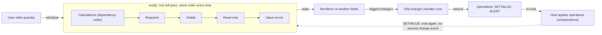

<PageBadges />

import { Callout } from "zudoku/ui/Callout"

El motor no rastrea qué campos se ven afectados por un cambio. Cada vez que algo cambia, ejecuta una
pasada de evaluación completa sobre todo el formulario, siempre en el mismo orden. Conocer ese orden
explica la mayor parte de lo que ves en tiempo de ejecución: por qué un campo calculado puede
controlar la visibilidad, por qué un campo oculto sigue contando en un cálculo y cuándo se ejecutan
los manejadores de eventos.

## Crear un motor

`createFormEngine({ schema, initialValues })` prepara el formulario una sola vez:

1. Valida el esquema y lanza un error si no es válido. Consulta
   [Validación de esquemas](/es/core/schema/validation).
2. Asigna los valores: primero los `initialValues` que pasas y después el `default_value` de cada uno
   de los demás campos.
3. Determina de qué campos depende cada campo calculado. Esto ocurre una sola vez, no en cada
   evaluación.
4. Ejecuta `form.events.code` una vez para registrar los manejadores de eventos. En este momento no
   se despacha ningún evento.

Crear un motor no evalúa el formulario. La visibilidad, la obligatoriedad y los errores siguen vacíos
hasta la primera llamada a `engine.eval()`. Los bindings oficiales la hacen justo después de crear
el motor.

## Una pasada de evaluación

`engine.eval()` ejecuta estos pasos en orden, siempre:

<EngineDiagram name="evaluation-cycle">



</EngineDiagram>

| Paso              | Qué ocurre                                                                                     | Resultado en el estado |
| ----------------- | ---------------------------------------------------------------------------------------------- | ---------------------- |
| 1. Cálculos       | Cada `CalculatedField` ejecuta su expresión `calculate`, primero las dependencias              | `values`               |
| 2. Obligatoriedad | Se comprueba `required_conditions` o se usa el indicador estático `required`                   | `required`             |
| 3. Visibilidad    | Se comprueba `visible_conditions` o se usa el indicador estático `visible`                     | `visible`              |
| 4. Solo lectura   | Se comprueba `read_only_conditions` o se usa el indicador estático `read_only`                 | `read_only`            |
| 5. Validación     | El valor de cada campo se comprueba con sus propias reglas, como `pattern` o el rango numérico | `errors`               |

Después de la pasada, `engine.getState()` devuelve el resultado. Los mismos valores producen siempre
el mismo estado, sin importar el orden en que el usuario los introdujo.

### Qué implica el orden para tu esquema

- **Las condiciones ven los valores calculados.** Los cálculos se ejecutan primero, así que un
  `visible_conditions` o un `required_conditions` puede hacer referencia a un `CalculatedField` y
  siempre obtiene su valor actual.
- **Los cálculos ignoran la visibilidad.** Ocultar un campo no borra su valor. El valor de un campo
  oculto sigue en `values` y sigue contando en cualquier cálculo que lo use.
- **La validación cubre todos los campos.** Los errores de valor se calculan también para los campos
  ocultos. Un campo obligatorio vacío no es un error en `errors`: el renderer o tu aplicación decide
  si bloquea el envío. Consulta [Campos obligatorios y envío](/es/core/schema/validation).
- **Las condiciones sobre campos de elección comparan los valores seleccionados.** Una condición
  sobre un campo de elección compara el `value` de la opción seleccionada, no todo el objeto
  almacenado. Consulta [Condiciones y operadores](/es/core/schema/conditions-operators).

### Las secciones siguen a sus hijos

La visibilidad se evalúa desde los campos más internos hacia fuera. Una `Section` o una
`RepeatableSection` cuyos hijos están todos ocultos también se oculta, digan lo que digan sus
`visible` o `visible_conditions`. Si al menos un hijo es visible, se aplica la configuración propia
de la sección.

## Cuando cambia un valor

El motor no tiene un paso de "actualización" aparte. Cuando un usuario edita un campo, los bindings
oficiales:

1. Escriben el nuevo valor en los valores del motor.
2. Ejecutan `engine.eval()`, que repite la pasada completa descrita arriba.
3. Publican el nuevo estado en la interfaz.
4. Despachan `change` para el campo editado, lo que ejecuta cualquier manejador
   `ON("change", ...)` que coincida.

Los manejadores de eventos nunca modifican el formulario por sí mismos. Devuelven una lista de
operaciones, como `SETVALUE` o `ALERT`, y el host las aplica. Cuando el host aplica un `SETVALUE`,
escribe el valor y vuelve a ejecutar `eval()`, pero no despacha otro evento `change`. Por eso un
manejador no puede iniciar una cadena de eventos de cambio al asignar otros campos.

<Callout type="info" title="Soporte de eventos en los bindings">
  form0-core define un vocabulario de eventos más amplio, que incluye eventos de registro, de campo
  y de sección repetible. Los renderers oficiales despachan actualmente los eventos portables de
  ciclo de vida `load-record`, `edit-record` y `change`. Los demás eventos no se despachan
  automáticamente porque su momento depende del flujo y de la interfaz de la aplicación host. Las
  aplicaciones pueden despacharlos explícitamente con `engine.trigger(...)`. Otros despachos
  automáticos pueden evaluarse caso por caso, pero los esquemas solo deberían depender de los
  eventos que documenta su host o binding. Consulta [Despacho de eventos en los bindings
  oficiales](/es/core/builtins/events-overview).
</Callout>

## Usar el motor sin un renderer

Si controlas el motor tú mismo, sigue la misma secuencia que usan los bindings:

```js
import { createFormEngine } from "form0-core"

const engine = createFormEngine({ schema, initialValues: { quantity: 2 } })
engine.eval()

// When the user changes a value:
engine.getState().values.quantity = 3
engine.eval()

// Then dispatch the change event and apply the operations it returns.
const operations = engine.trigger("change", "quantity")
```

<Callout type="caution" title="Los campos de elección usan formas de valor en tiempo de ejecución">
  `initialValues` y las escrituras directas en `engine.getState().values` deben usar la forma de valor
  en tiempo de ejecución del motor. Por ejemplo, un `SingleChoiceField` o un `BooleanField` usa
  `{ "choice": [{ "value": "it", "label": "Italy" }], "other": [] }`, mientras que un
  `MultiChoiceField` usa `choices` en lugar de `choice`. Esta forma es distinta del `default_value`
  escalar o de tipo array de un campo de elección en el esquema. Los componentes de campo de los
  renderers oficiales producen estas formas; form0-core no ofrece actualmente un método público para
  asignar y normalizar valores.
</Callout>

Tu aplicación es responsable de aplicar las operaciones devueltas y de decidir cuándo un campo
obligatorio vacío bloquea el envío.
