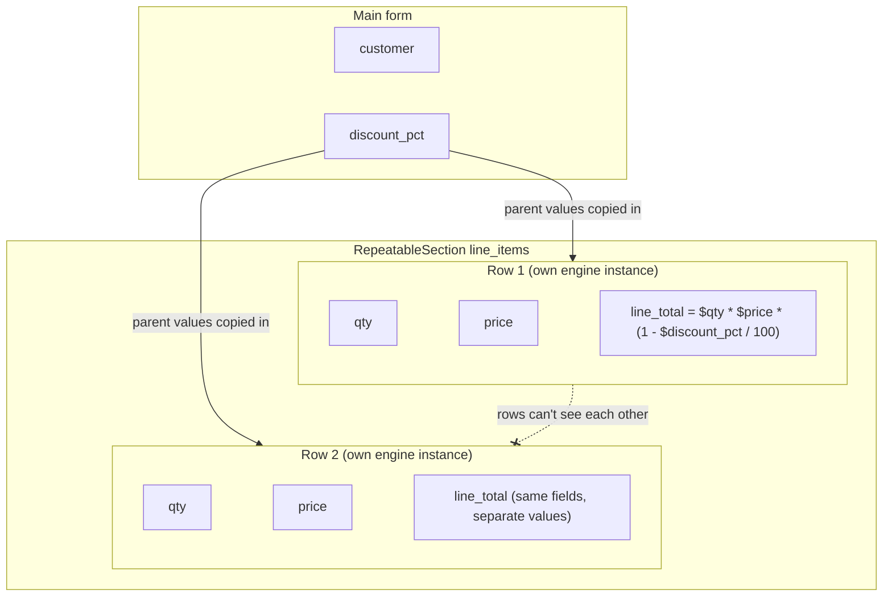

<PageBadges />

Una `RepeatableSection` permite al usuario añadir cualquier número de filas, como las líneas de un
pedido. Cada fila guarda sus propios valores para el mismo conjunto de campos. Esta página explica
cómo se evalúan las filas y qué campos puede leer una expresión del formulario principal y de una
fila.

## Cómo se evalúan las filas

En los renderers oficiales de React y React Native, un motor evalúa el formulario principal. Cada
fila se evalúa en una instancia de motor distinta cuando se abre. El motor de la fila usa el mismo
esquema y parte de una copia de los valores de todo lo que la contiene, más los valores propios de
la fila:

- una fila de una `RepeatableSection` de primer nivel recibe los valores del formulario principal;
- una fila de una `RepeatableSection` anidada recibe también los valores de la fila que la contiene.

Cada fila tiene entonces sus propios `values`, `visible`, `required`, `read_only` y `errors`. Dos
filas nunca comparten estado, aunque usen los mismos campos.

Si usas `form0-core` sin un renderer oficial, el core no crea los motores de las filas por ti. Tu
aplicación es responsable de crear un motor para cada evaluación de fila y de proporcionar los
valores correspondientes del formulario principal, de las filas antecesoras y de la fila actual.

<EngineDiagram name="repeatable-scope">

</EngineDiagram>

## Qué puede leer una expresión

El lugar donde se define una expresión decide qué campos puede leer:

| Definida en                          | Campos del formulario principal | Campos de la misma fila | Campos de las filas que la contienen | Campos de otras filas |
| ------------------------------------ | ------------------------------- | ----------------------- | ------------------------------------ | --------------------- |
| Un campo del formulario principal    | Sí                              | No aplica               | No aplica                            | No                    |
| Un campo de una fila de primer nivel | Sí                              | Sí                      | No aplica                            | No                    |
| Un campo de una fila anidada         | Sí                              | Sí                      | Sí                                   | No                    |

En el ejemplo del pedido, `line_total` de cada fila puede usar `$discount_pct` del formulario
principal y `$qty` y `$price` de su propia fila. Un campo calculado del formulario principal no puede
leer `$line_total` directamente, porque cada fila tiene su propio valor.

Los cálculos y los manejadores de eventos de campo siguen estas reglas de acceso. Una referencia de
un cálculo fuera de los campos permitidos lee `undefined`, y el motor emite un aviso como
`Field 'line_total' is not accessible from current context`.

Las condiciones se evalúan con los valores disponibles en el motor actual. En un editor de filas
oficial, eso incluye el formulario principal, las filas antecesoras y la fila actual. Las
condiciones no deberían hacer referencia a campos de otra rama repetible. Actualmente, el core no
emite avisos de acceso fuera de ámbito para las referencias en condiciones.

## Los valores del padre son una copia

Una fila lee los valores del padre que se copiaron en su motor. Los renderers oficiales copian los
valores actuales del padre cada vez que se abre una fila. Cambiar después un valor del padre no
recalcula las demás filas: cada una conserva los valores calculados de su última evaluación hasta que
se vuelve a abrir.

## Eventos y filas

Los renderers oficiales despachan `load-record`, `edit-record` y `change` solo para el registro
principal. Abrir o editar una fila no despacha ningún evento, así que no vuelve a ejecutar los
manejadores del registro principal.

form0-core reconoce nombres de eventos del ciclo de vida de los repetibles, como `new-repeatable` y
`save-repeatable`, pero los bindings oficiales todavía no definen su momento portable, los metadatos
de la fila ni el ámbito ligado a la instancia. Una aplicación que los despache directamente debe
definir por ahora ese contrato por su cuenta. Consulta
[Despacho de eventos en los bindings oficiales](/es/core/builtins/events-overview).

Los eventos de registro, como `load-record`, solo pueden leer campos del formulario principal. Los
eventos de campo, como `change`, siguen las mismas reglas que un cálculo definido en el campo que los
desencadenó.

## Las filas en el registro de salida

Al enviar el formulario, cada fila se convierte en un registro hijo del registro principal. Consulta
[Salida y registros](/es/core/output-records).
