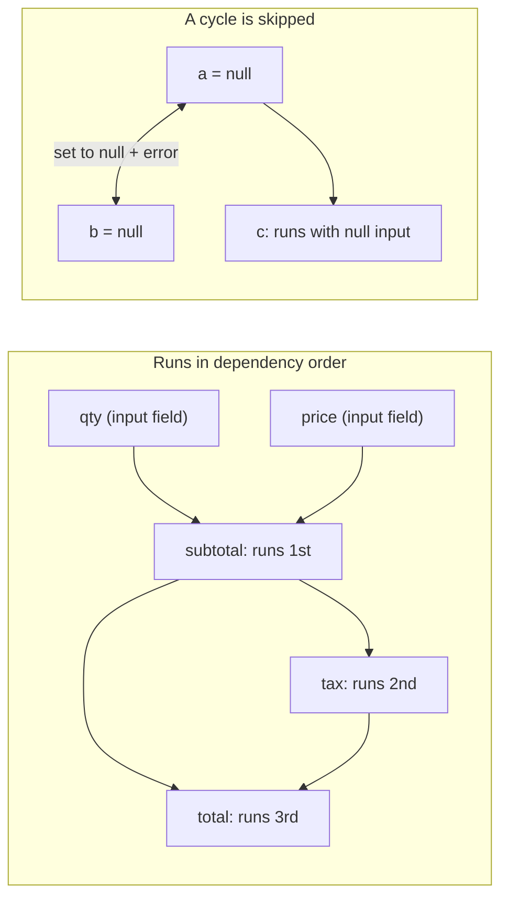

<PageBadges />

import { Callout } from "zudoku/ui/Callout"

Chaque `CalculatedField` possède une expression `calculate`. Les calculs sont la première étape de
chaque [passe d'évaluation](/fr/core/engine/evaluation-cycle) : les conditions et la validation
voient donc toujours des valeurs calculées à jour. Cette page explique dans quel ordre les calculs
s'exécutent et ce qui se passe quand une expression ne peut pas produire de valeur.

## Référencer des champs

Dans une expression, `$data_name` lit la valeur actuelle d'un champ. Les expressions référencent les
champs par leur `data_name`, tandis que les conditions utilisent `field_id`.

Les valeurs gardent la forme sous laquelle le moteur les stocke. Un `NumericField` fournit un nombre,
mais un champ à choix fournit un objet contenant les choix sélectionnés. Utilisez des builtins comme
[`CHOICEVALUE`](/fr/core/builtins/calculations-expressions/choicevalue) et
[`CHOICELABEL`](/fr/core/builtins/calculations-expressions/choicelabel) pour lire les champs à choix.

Une expression est du JavaScript. Pour une logique qui ne tient pas sur une ligne, écrivez du code
sur plusieurs lignes et renvoyez le résultat avec
[`SETRESULT`](/fr/core/builtins/calculations-expressions/setresult).

## Ordre des dépendances

À la création d'un moteur, celui-ci lit une fois chaque expression `calculate` et note les
`$fields` qu'elle référence. Pendant l'évaluation, un champ calculé s'exécute toujours après les
champs calculés dont il dépend. L'ordre des champs dans le schéma n'a pas d'importance.

Par exemple, ces champs sont déclarés dans l'ordre inverse :

| Champ (ordre dans le schéma) | `calculate`        |
| ---------------------------- | ------------------ |
| `total`                      | `$subtotal + $tax` |
| `tax`                        | `$subtotal * 0.2`  |
| `subtotal`                   | `$qty * $price`    |

Avec `qty` à 2 et `price` à 10, le moteur exécute d'abord `subtotal` (20), puis `tax` (4), puis
`total` (24). Une seule passe suffit, quelle que soit la longueur de la chaîne.

<EngineDiagram name="calculation-order">



</EngineDiagram>

## Cycles

Un cycle apparaît quand des champs calculés dépendent les uns des autres en boucle, soit directement
(`a` utilise `$a`), soit par d'autres champs (`a` utilise `$b` et `b` utilise `$a`). Le moteur ne
peut pas ordonner ces champs, donc il :

- met à `null` chaque champ du cycle ;
- émet, via `WarningSystem`, un diagnostic de dépendance qui nomme le cycle, par exemple
  `CalculatedField dependency cycle detected: a -> b` ; et
- calcule quand même tous les autres champs.

Le diagnostic de cycle n'est pas ajouté à la table `errors` de validation des valeurs dans l'état du
formulaire.

Un champ qui référence un champ du cycle s'exécute quand même, avec `null` en entrée. En JavaScript,
`null * 2` vaut `0`, donc `c` avec `$a * 2` affiche `0` et non `null`.

Un cycle ne rend pas le schéma invalide : la création du moteur réussit. Le diagnostic apparaît lors
de l'évaluation du formulaire. Pour le corriger, cassez la boucle, par exemple en transformant l'un
des champs en champ de saisie.

## Quand une expression échoue

Si une expression lève une erreur, par exemple parce qu'elle appelle une méthode sur `null`, ce champ
calculé est mis à `null` pour cette passe. Les autres champs calculés s'exécutent quand même ; un
champ qui dépend du champ en échec reçoit `null` et peut produire une autre valeur ou échouer à son
tour.

Si une expression référence un champ qui n'existe pas dans le schéma, le moteur signale aussi un
avertissement qui nomme ce champ. Dans le [mode de sécurité](/fr/core/security) `SAFE`, une
expression qui utilise quelque chose que le mode n'autorise pas est rejetée et le champ est mis à
`null`.

## Références dynamiques avec EVAL()

[`EVAL`](/fr/core/builtins/calculations-expressions/eval) lit un champ dont le nom est fourni sous
forme de chaîne. La façon dont le moteur l'ordonne dépend de cette chaîne :

- **Un nom fixe**, comme `EVAL('$price')`, est traité comme `$price` et ordonné normalement.
- **Un nom construit à l'exécution**, comme `EVAL('$' + $unit + '_price')`, ne peut pas être connu à
  l'avance.

Dès qu'un champ calculé utilise un nom construit à l'exécution, le moteur ne peut plus garantir
l'ordre. Il exécute alors tous les champs calculés de façon répétée jusqu'à ce qu'aucune valeur ne
change, avec au plus une passe par champ calculé (au moins deux). Si des valeurs changent encore après
la dernière passe, il signale un avertissement qui nomme ces champs. Il signale aussi un
avertissement pour chaque champ qui utilise un nom construit à l'exécution.

<Callout type="tip" title="Préférez les références directes">
  Écrivez `$price` plutôt que `EVAL('$price')` chaque fois que le nom du champ est connu. Les
  références directes conservent une seule passe ordonnée et rendent les dépendances visibles pour
  toute personne qui lit le schéma.
</Callout>

## Voir les erreurs et les avertissements

Pendant l'exécution des calculs, le moteur consigne chaque problème rencontré sous forme de
**diagnostic** : un cycle, une référence à un champ inexistant, une expression qui lève une erreur,
etc. Les diagnostics sont distincts de `state.errors`. Ils ne rendent jamais une soumission invalide.

### Lire les diagnostics

Appelez `engine.getDiagnostics()` après `eval()`. La méthode renvoie les diagnostics de la dernière
évaluation, ou `[]` avant la première :

```js
const engine = createFormEngine({ schema })
engine.eval()

for (const diagnostic of engine.getDiagnostics()) {
  console.log(diagnostic.code, diagnostic.fieldName, diagnostic.message)
}
```

Chaque `eval()` remplace la liste au lieu de la compléter : un problème disparaît dès que sa cause
est corrigée. Supposons que `quotient` ait cette expression `calculate` :

```js
if ($divisor === 0) {
  throw new Error("Divisor cannot be zero")
}
SETRESULT($numerator / $divisor)
```

```js
engine.getState().values.divisor = 0
engine.eval()
engine.getDiagnostics() // [{ code: "runtime_exception", fieldName: "quotient", ... }]

engine.getState().values.divisor = 4
engine.eval()
engine.getDiagnostics() // []
```

Dans une même évaluation, chaque problème n'est signalé qu'une fois, même si le moteur exécute le
calcul en plusieurs passes. Un échec lors d'une des premières passes reste signalé même si une passe
ultérieure de la même évaluation réussit.

Un calcul qui renvoie `null`, `undefined`, `NaN` ou `Infinity` n'est pas une erreur. Sans le
`throw`, `$numerator / 0` renvoie `Infinity` et ne produit aucun diagnostic.

`getDiagnostics()` renvoie une copie : modifier le tableau n'a aucun effet sur le moteur.

### Réagir à chaque évaluation

Pour recevoir les diagnostics sans appeler `getDiagnostics()`, passez `onDiagnostics` à la création
du moteur. Le moteur l'appelle une fois après chaque `eval()`, même si la liste est vide ou
inchangée :

```js
const engine = createFormEngine({
  schema,
  onDiagnostics(diagnostics) {
    showCalculationProblems(diagnostics) // your own function
  },
})
```

Si `onDiagnostics` lève une erreur ou renvoie une promesse rejetée, l'évaluation se termine quand
même.

### Contenu d'un diagnostic

| Propriété    | Description                                                                                    |
| ------------ | ---------------------------------------------------------------------------------------------- |
| `code`       | L'un des codes du tableau suivant.                                                             |
| `severity`   | `error` ou `warning`.                                                                          |
| `message`    | Une description lisible du problème.                                                           |
| `fieldName`  | Le `data_name` du champ calculé.                                                               |
| `phase`      | L'étape où le problème est survenu : `dependency`, `scope`, `validation`, `syntax`, `runtime`. |
| `suggestion` | Une piste pour corriger le problème, ou `null` s'il n'y en a pas.                              |
| `context`    | Des détails supplémentaires, toujours sérialisables en JSON.                                   |

`context` contient toujours `source`, qui vaut `expression` pour le calcul lui-même ou `EVAL` pour
un appel à `EVAL()` à l'intérieur de celui-ci, et `parentPath`, les clés des RepeatableSection qui
contiennent le champ. Selon le code, il contient aussi `referencedFieldName`, `fieldNames` (les
champs concernés) ou `maxPasses`.

Le moteur n'ajoute à un diagnostic ni le code source de l'expression, ni les valeurs des champs, ni
les traces de pile. `message` peut toutefois contenir le texte d'une erreur levée par votre
expression.

### Codes de diagnostic

Les codes sont stables : votre application peut s'appuyer dessus.

| Code                           | Gravité | Phase      | Signification                                                                                       |
| ------------------------------ | ------- | ---------- | --------------------------------------------------------------------------------------------------- |
| `dynamic_dependencies`         | warning | dependency | Le champ construit à l'exécution un nom passé à `EVAL()`, ce qui impose des passes supplémentaires. |
| `cyclic_dependencies`          | error   | dependency | Le champ fait partie d'un [cycle](#cycles) et a été mis à `null`.                                   |
| `non_converging_runtime`       | warning | dependency | Des valeurs changeaient encore après la dernière passe (`maxPasses`).                               |
| `missing_reference`            | warning | scope      | L'expression référence un champ absent du schéma.                                                   |
| `restricted_reference`         | warning | scope      | L'expression référence un champ hors de sa portée.                                                  |
| `expression_validation_failed` | error   | validation | Le [mode de sécurité](/fr/core/security) ou un builtin a rejeté l'expression.                       |
| `invalid_syntax`               | error   | syntax     | La syntaxe de l'expression est invalide.                                                            |
| `compilation_error`            | error   | syntax     | L'expression n'a pas pu être compilée, par exemple à cause d'une règle CSP.                         |
| `runtime_exception`            | error   | runtime    | L'expression a levé une erreur, y compris un `SyntaxError` qu'elle a levé elle-même.                |
| `eval_invalid_argument`        | error   | validation | `EVAL()` a reçu autre chose qu'une chaîne non vide.                                                 |
| `eval_reference_unavailable`   | error   | scope      | `EVAL()` n'a pas trouvé le champ qu'il devait lire.                                                 |

### Sortie dans la console

Par défaut, le moteur affiche aussi les problèmes dans la console :

- Les avertissements de dépendance et de portée ne s'affichent qu'en développement. Node.js est
  considéré en développement sauf si `NODE_ENV` vaut `production`. Dans un navigateur, les pages sur
  `localhost`, `127.0.0.1` ou une URL avec un port explicite sont considérées en développement.
- Les échecs d'expression et d'`EVAL()` s'affichent dans tous les environnements.

Pour choisir vous-même, définissez `diagnostics.console` :

- `console: false` n'affiche rien sur les calculs, pas même les messages de débogage d'`EVAL()`.
  Utilisez-le lorsque vous affichez les diagnostics dans votre propre interface.
- `console: true` affiche chaque diagnostic, en développement comme en production.

```js
const engine = createFormEngine({ schema, diagnostics: { console: false } })
```

Si vous passez votre propre `WarningSystem`, ses gestionnaires reçoivent toujours les avertissements
de dépendance et de portée.

## Champs calculés dans les sections répétables

Un champ calculé placé dans une `RepeatableSection` s'exécute une fois par ligne. Il peut référencer
les champs du formulaire principal, les champs de sa propre ligne et les champs des lignes qui la
contiennent. Une référence à un champ hors de cette portée lit `undefined` et produit un
avertissement. Voir [Portées parent et enfant](/fr/core/engine/parent-child-scopes).
