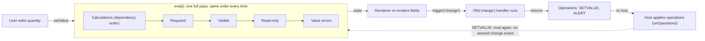

<PageBadges />

import { Callout } from "zudoku/ui/Callout"

Le moteur ne suit pas les champs concernés par une modification. Chaque fois que quelque chose
change, il exécute une passe d'évaluation complète sur tout le formulaire, toujours dans le même
ordre. Connaître cet ordre explique l'essentiel de ce que vous observez à l'exécution : pourquoi un
champ calculé peut piloter la visibilité, pourquoi un champ masqué compte toujours dans un calcul et
quand les gestionnaires d'événements s'exécutent.

## Créer un moteur

`createFormEngine({ schema, initialValues })` prépare le formulaire une seule fois :

1. Il valide le schéma et lève une erreur s'il n'est pas valide. Voir
   [Validation du schéma](/fr/core/schema/validation).
2. Il renseigne les valeurs : d'abord les `initialValues` que vous passez, puis le `default_value`
   de chacun des autres champs.
3. Il détermine de quels champs dépend chaque champ calculé. Cela se fait une seule fois, et non à
   chaque évaluation.
4. Il exécute `form.events.code` une fois pour enregistrer les gestionnaires d'événements. Aucun
   événement n'est déclenché à ce stade.

Créer un moteur n'évalue pas le formulaire. La visibilité, le caractère obligatoire et les erreurs
restent vides jusqu'au premier appel à `engine.eval()`. Les bindings officiels l'appellent juste
après avoir créé le moteur.

## Une passe d'évaluation

`engine.eval()` exécute ces étapes dans l'ordre, à chaque fois :

<EngineDiagram name="evaluation-cycle">



</EngineDiagram>

| Étape               | Ce qui se passe                                                                                         | Résultat dans l'état |
| ------------------- | ------------------------------------------------------------------------------------------------------- | -------------------- |
| 1. Calculs          | Chaque `CalculatedField` exécute son expression `calculate`, dépendances d'abord                        | `values`             |
| 2. Caractère requis | `required_conditions` est vérifié, sinon l'indicateur statique `required` est utilisé                   | `required`           |
| 3. Visibilité       | `visible_conditions` est vérifié, sinon l'indicateur statique `visible` est utilisé                     | `visible`            |
| 4. Lecture seule    | `read_only_conditions` est vérifié, sinon l'indicateur statique `read_only` est utilisé                 | `read_only`          |
| 5. Validation       | La valeur de chaque champ est vérifiée selon ses propres règles, comme `pattern` ou une plage numérique | `errors`             |

Après la passe, `engine.getState()` renvoie le résultat. Les mêmes valeurs produisent toujours le
même état, quel que soit l'ordre dans lequel l'utilisateur les a saisies.

`eval()` collecte aussi les diagnostics des calculs, comme les cycles ou les expressions qui lèvent
une erreur. Lisez-les avec `engine.getDiagnostics()`. Ils ne modifient ni `errors`, ni les
conditions, ni les événements. Consultez
[Voir les erreurs et les avertissements](/fr/core/engine/calculations-dependencies#voir-les-erreurs-et-les-avertissements).

### Ce que l'ordre implique pour votre schéma

- **Les conditions voient les valeurs calculées.** Les calculs s'exécutent en premier : un
  `visible_conditions` ou un `required_conditions` peut donc référencer un `CalculatedField` et
  obtient toujours sa valeur actuelle.
- **Les calculs ignorent la visibilité.** Masquer un champ n'efface pas sa valeur. La valeur d'un
  champ masqué reste dans `values` et compte toujours dans tout calcul qui la référence.
- **La validation couvre tous les champs.** Les erreurs de valeur sont aussi calculées pour les
  champs masqués. Un champ obligatoire vide n'est pas une erreur dans `errors` : c'est le renderer ou
  votre application qui décide s'il bloque la soumission. Voir
  [Champs obligatoires et soumission](/fr/core/schema/validation).
- **Les conditions sur les champs à choix comparent les valeurs sélectionnées.** Une condition sur
  un champ à choix compare la `value` du choix sélectionné, et non l'objet stocké en entier. Voir
  [Conditions et opérateurs](/fr/core/schema/conditions-operators).

### Les sections suivent leurs enfants

La visibilité est évaluée des champs les plus internes vers l'extérieur. Une `Section` ou une
`RepeatableSection` dont tous les enfants sont masqués est elle aussi masquée, quels que soient ses
`visible` ou `visible_conditions`. Si au moins un enfant est visible, les réglages propres à la
section s'appliquent.

## Quand une valeur change

Le moteur n'a pas d'étape de « mise à jour » distincte. Quand un utilisateur modifie un champ, les
bindings officiels :

1. Écrivent la nouvelle valeur dans les valeurs du moteur.
2. Exécutent `engine.eval()`, qui répète la passe complète décrite ci-dessus.
3. Publient le nouvel état dans l'interface.
4. Déclenchent `change` pour le champ modifié, ce qui exécute tout gestionnaire
   `ON("change", ...)` correspondant.

Les gestionnaires d'événements ne modifient jamais le formulaire eux-mêmes. Ils renvoient une liste
d'opérations, comme `SETVALUE` ou `ALERT`, et le host les applique. Quand le host applique un
`SETVALUE`, il écrit la valeur et exécute de nouveau `eval()`, mais il ne déclenche pas d'autre
événement `change`. Un gestionnaire ne peut donc pas lancer une chaîne d'événements de modification
en définissant d'autres champs.

<Callout type="info" title="Prise en charge des événements dans les bindings">
  form0-core définit un vocabulaire d'événements plus large, qui comprend des événements
  d'enregistrement, de champ et de section répétable. Les renderers officiels déclenchent
  actuellement les événements de cycle de vie portables `load-record`, `edit-record` et `change`.
  Les autres événements ne sont pas déclenchés automatiquement, car leur moment dépend du flux et de
  l'interface de l'application host. Les applications peuvent les déclencher explicitement avec
  `engine.trigger(...)`. D'autres déclenchements automatiques pourront être étudiés au cas par cas,
  mais les schémas ne doivent s'appuyer que sur les événements documentés par leur host ou leur
  binding. Voir [Déclenchement des événements dans les bindings
  officiels](/fr/core/builtins/events-overview).
</Callout>

## Utiliser le moteur sans renderer

Si vous pilotez le moteur vous-même, suivez la même séquence que les bindings :

```js
import { createFormEngine } from "form0-core"

const engine = createFormEngine({ schema, initialValues: { quantity: 2 } })
engine.eval()

// When the user changes a value:
engine.getState().values.quantity = 3
engine.eval()

// Then dispatch the change event and apply the operations it returns.
const operations = engine.trigger("change", "quantity")
```

<Callout type="caution" title="Les champs à choix utilisent des formes de valeur d'exécution">
  Les `initialValues` et les écritures directes dans `engine.getState().values` doivent utiliser la
  forme de valeur d'exécution du moteur. Par exemple, un `SingleChoiceField` ou un `BooleanField`
  utilise `{ "choice": [{ "value": "it", "label": "Italy" }], "other": [] }`, tandis qu'un
  `MultiChoiceField` utilise `choices` au lieu de `choice`. Cette forme diffère du `default_value`
  scalaire ou tableau d'un champ à choix dans le schéma. Les composants de champ des renderers
  officiels produisent ces formes ; form0-core ne fournit pas encore de méthode publique pour définir
  et normaliser les valeurs.
</Callout>

Votre application doit appliquer les opérations renvoyées et décider quand un champ obligatoire vide
bloque la soumission.
