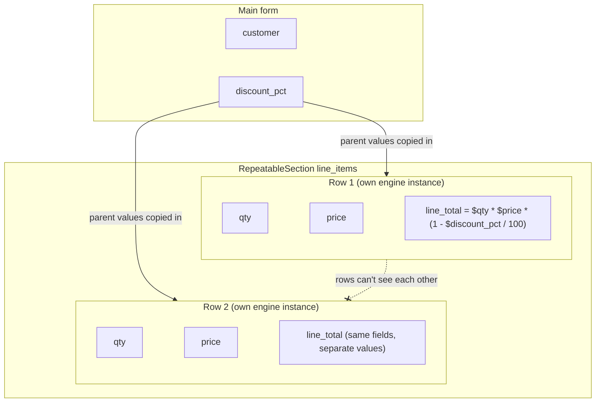

<PageBadges />

Une `RepeatableSection` permet à l'utilisateur d'ajouter autant de lignes qu'il le souhaite, comme
les lignes d'une commande. Chaque ligne contient ses propres valeurs pour le même ensemble de
champs. Cette page explique comment les lignes sont évaluées et quels champs une expression peut lire
dans le formulaire principal et dans une ligne.

## Évaluation des lignes

Dans les renderers officiels React et React Native, le formulaire principal est évalué par un moteur.
Chaque ligne est évaluée dans une instance de moteur distincte lorsqu'elle est ouverte. Le moteur de
la ligne utilise le même schéma et part d'une copie des valeurs de tout ce qui la contient, plus les
valeurs propres à la ligne :

- une ligne d'une `RepeatableSection` de premier niveau reçoit les valeurs du formulaire principal ;
- une ligne d'une `RepeatableSection` imbriquée reçoit aussi les valeurs de la ligne qui la contient.

Chaque ligne possède alors ses propres `values`, `visible`, `required`, `read_only` et `errors`.
Deux lignes ne partagent jamais d'état, même si elles utilisent les mêmes champs.

Si vous utilisez `form0-core` sans renderer officiel, le core ne crée pas les moteurs des lignes à
votre place. Votre application doit créer un moteur pour chaque évaluation de ligne et fournir les
valeurs pertinentes du formulaire principal, des lignes ancêtres et de la ligne courante.

<EngineDiagram name="repeatable-scope">

</EngineDiagram>

## Ce qu'une expression peut lire

L'endroit où une expression est définie détermine les champs qu'elle peut lire :

| Définie sur                            | Champs du formulaire principal | Champs de la même ligne | Champs des lignes qui la contiennent | Champs des autres lignes |
| -------------------------------------- | ------------------------------ | ----------------------- | ------------------------------------ | ------------------------ |
| Un champ du formulaire principal       | Oui                            | Sans objet              | Sans objet                           | Non                      |
| Un champ d'une ligne de premier niveau | Oui                            | Oui                     | Sans objet                           | Non                      |
| Un champ d'une ligne imbriquée         | Oui                            | Oui                     | Oui                                  | Non                      |

Dans l'exemple de la commande, `line_total` dans chaque ligne peut utiliser `$discount_pct` du
formulaire principal, ainsi que `$qty` et `$price` de sa propre ligne. Un champ calculé du formulaire
principal ne peut pas lire `$line_total` directement, car chaque ligne a sa propre valeur.

Les calculs et les gestionnaires d'événements de champ suivent ces règles d'accès. Une référence d'un
calcul en dehors des champs autorisés lit `undefined`, et le moteur signale un avertissement comme
`Field 'line_total' is not accessible from current context`.

Les conditions sont évaluées avec les valeurs disponibles dans le moteur courant. Dans un éditeur de
ligne officiel, cela comprend le formulaire principal, les lignes ancêtres et la ligne courante. Les
conditions ne doivent pas référencer des champs d'une autre branche répétable. Le core ne signale pas
encore d'avertissement d'accès hors portée pour les références dans les conditions.

## Les valeurs du parent sont une copie

Une ligne lit les valeurs du parent qui ont été copiées dans son moteur. Les renderers officiels
copient les valeurs actuelles du parent chaque fois qu'une ligne est ouverte. Modifier ensuite une
valeur du parent ne recalcule pas les autres lignes : chacune garde les valeurs calculées de sa
dernière évaluation, jusqu'à ce qu'elle soit rouverte.

## Événements et lignes

Les renderers officiels déclenchent `load-record`, `edit-record` et `change` uniquement pour
l'enregistrement principal. Ouvrir ou modifier une ligne ne déclenche aucun événement, et ne
relance donc pas les gestionnaires de l'enregistrement principal.

form0-core reconnaît des noms d'événements de cycle de vie des répétables comme `new-repeatable` et
`save-repeatable`, mais les bindings officiels n'en définissent pas encore le moment portable, les
métadonnées de ligne ni la portée liée à l'instance. Une application qui les déclenche directement
doit pour l'instant définir ce contrat elle-même. Voir
[Déclenchement des événements dans les bindings officiels](/fr/core/builtins/events-overview).

Les événements d'enregistrement, comme `load-record`, ne peuvent lire que les champs du formulaire
principal. Les événements de champ, comme `change`, suivent les mêmes règles qu'un calcul défini sur
le champ qui les a déclenchés.

## Les lignes dans l'enregistrement de sortie

Lors de la soumission du formulaire, chaque ligne devient un enregistrement enfant de
l'enregistrement principal. Voir [Sorties et enregistrements](/fr/core/output-records).
