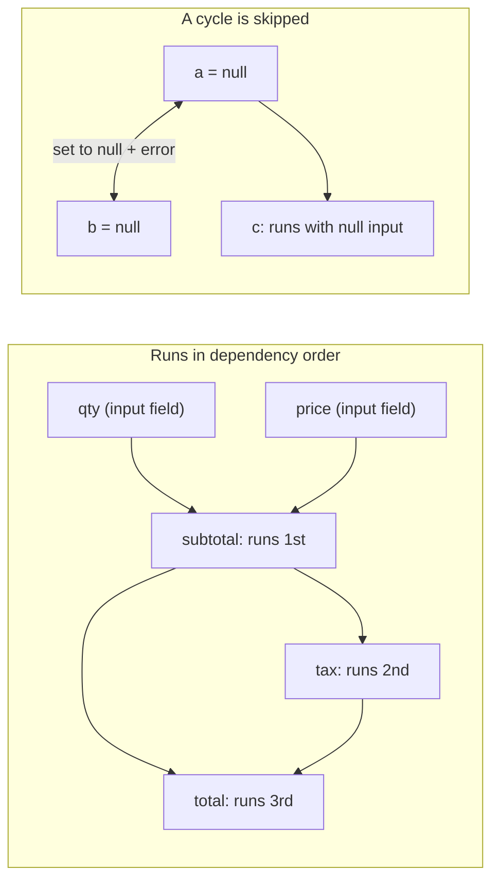

<PageBadges />

import { Callout } from "zudoku/ui/Callout"

Ogni `CalculatedField` ha un'espressione `calculate`. I calcoli sono il primo passaggio di ogni
[passaggio di valutazione](/it/core/engine/evaluation-cycle), quindi condizioni e validazione vedono
sempre i valori calcolati aggiornati. Questa pagina spiega in che ordine vengono eseguiti i calcoli e
cosa succede quando un'espressione non riesce a produrre un valore.

## Fare riferimento ai campi

In un'espressione, `$data_name` legge il valore corrente di un campo. Le espressioni fanno
riferimento ai campi tramite `data_name`, mentre le condizioni usano `field_id`.

I valori mantengono la forma in cui il motore li memorizza. Un `NumericField` restituisce un numero,
mentre un campo a scelta restituisce un oggetto con le scelte selezionate. Per leggere i campi a
scelta usa builtin come [`CHOICEVALUE`](/it/core/builtins/calculations-expressions/choicevalue) e
[`CHOICELABEL`](/it/core/builtins/calculations-expressions/choicelabel).

Un'espressione è JavaScript. Per una logica che non sta su una riga, scrivi codice su più righe e
restituisci il risultato con [`SETRESULT`](/it/core/builtins/calculations-expressions/setresult).

## Ordine delle dipendenze

Quando crei un motore, questo legge una volta ogni espressione `calculate` e annota a quali `$fields`
fa riferimento. Durante la valutazione, un campo calcolato viene sempre eseguito dopo i campi
calcolati da cui dipende. L'ordine dei campi nello schema non conta.

Ad esempio, questi campi sono dichiarati in ordine inverso:

| Campo (ordine nello schema) | `calculate`        |
| --------------------------- | ------------------ |
| `total`                     | `$subtotal + $tax` |
| `tax`                       | `$subtotal * 0.2`  |
| `subtotal`                  | `$qty * $price`    |

Con `qty` impostato a 2 e `price` impostato a 10, il motore esegue prima `subtotal` (20), poi `tax`
(4), poi `total` (24). Basta un solo passaggio, per quanto lunga sia la catena.

<EngineDiagram name="calculation-order">



</EngineDiagram>

## Cicli

Un ciclo si verifica quando dei campi calcolati dipendono l'uno dall'altro ad anello, direttamente
(`a` usa `$a`) o tramite altri campi (`a` usa `$b` e `b` usa `$a`). Il motore non può ordinare questi
campi, quindi:

- imposta a `null` ogni campo del ciclo;
- emette, tramite `WarningSystem`, una diagnostica di dipendenza che nomina il ciclo, ad esempio
  `CalculatedField dependency cycle detected: a -> b`; e
- calcola comunque tutti gli altri campi.

La diagnostica del ciclo non viene aggiunta alla mappa `errors` di validazione dei valori nello stato
del modulo.

Un campo che fa riferimento a un campo del ciclo viene comunque eseguito, con `null` come input. In
JavaScript `null * 2` vale `0`, quindi `c` con `$a * 2` mostra `0` anziché `null`.

Un ciclo non rende lo schema non valido, quindi la creazione del motore va a buon fine. La
diagnostica compare quando il modulo viene valutato. Per risolverla, interrompi l'anello, ad esempio
trasformando uno dei campi in un campo di input.

## Quando un'espressione fallisce

Se un'espressione genera un errore, ad esempio perché chiama un metodo su `null`, quel campo
calcolato viene impostato a `null` per questo passaggio. Gli altri campi calcolati vengono comunque
eseguiti; un campo che dipende da quello fallito riceve `null` e può produrre un altro valore o
fallire a sua volta.

Se un'espressione fa riferimento a un campo che non esiste nello schema, il motore segnala anche un
avviso con il nome del campo. Nella [modalità di sicurezza](/it/core/security) `SAFE`, un'espressione
che usa qualcosa che la modalità non consente viene rifiutata e il campo viene impostato a `null`.

## Riferimenti dinamici con EVAL()

[`EVAL`](/it/core/builtins/calculations-expressions/eval) legge un campo il cui nome è indicato come
stringa. Il modo in cui il motore lo ordina dipende da quella stringa:

- **Un nome fisso**, come `EVAL('$price')`, viene trattato come `$price` e ordinato normalmente.
- **Un nome costruito durante l'esecuzione**, come `EVAL('$' + $unit + '_price')`, non può essere
  conosciuto in anticipo.

Quando un campo calcolato usa un nome costruito durante l'esecuzione, il motore non può più garantire
l'ordine. Esegue allora tutti i campi calcolati ripetutamente finché nessun valore cambia, fino a un
passaggio per ogni campo calcolato (almeno due). Se dopo l'ultimo passaggio alcuni valori cambiano
ancora, segnala un avviso con il nome di quei campi. Segnala anche un avviso per ogni campo che usa
un nome costruito durante l'esecuzione.

<Callout type="tip" title="Preferisci i riferimenti diretti">
  Scrivi `$price` invece di `EVAL('$price')` ogni volta che il nome del campo è noto. I riferimenti
  diretti mantengono un unico passaggio ordinato e rendono le dipendenze visibili a chiunque legga
  lo schema.
</Callout>

## Vedere errori e avvisi

Il motore segnala come avvisi i cicli, i nomi costruiti durante l'esecuzione in `EVAL()`, i valori
che non si stabilizzano e i riferimenti a campi mancanti. In sviluppo li stampa nella console.
Node.js è considerato in sviluppo a meno che `NODE_ENV` non sia `production`. In un browser sono
considerate in sviluppo le pagine su `localhost`, `127.0.0.1` o un URL con una porta esplicita.

Per raccogliere questi avvisi nella tua applicazione, passa il tuo `WarningSystem`:

```js
import { createFormEngine, WarningSystem } from "form0-core"

const warningSystem = new WarningSystem({ enableCollection: true })
const engine = createFormEngine({ schema, warningSystem })
engine.eval()

for (const warning of warningSystem.getCollectedWarnings()) {
  console.log(warning.message, warning.suggestion)
}
```

Puoi anche registrare una callback con `warningSystem.addWarningHandler(handler)`. Lo stesso avviso
ripetuto entro un secondo viene segnalato una sola volta.

Un'espressione che genera un errore non è un avviso. Il motore la stampa nella console come
`[form0] Expression evaluation failed`, in ogni ambiente, e imposta il campo a `null`.

## Campi calcolati nelle sezioni ripetibili

Un campo calcolato all'interno di una `RepeatableSection` viene eseguito una volta per ogni riga. Può
fare riferimento ai campi del modulo principale, ai campi della propria riga e ai campi delle righe
che la contengono. Un riferimento a un campo fuori da questo ambito legge `undefined` e genera un
avviso. Vedi [Ambiti padre e figlio](/it/core/engine/parent-child-scopes).
