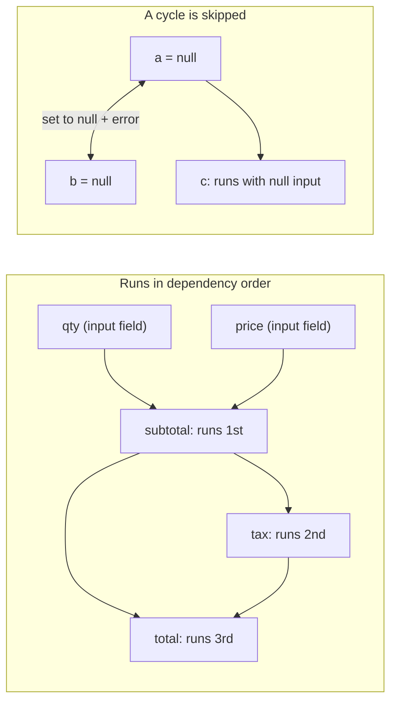

<PageBadges />

import { Callout } from "zudoku/ui/Callout"

Ogni `CalculatedField` ha un'espressione `calculate`. I calcoli sono il primo passaggio di ogni
[passaggio di valutazione](/it/core/engine/evaluation-cycle), quindi condizioni e validazione vedono
sempre i valori calcolati aggiornati. Questa pagina spiega in che ordine vengono eseguiti i calcoli e
cosa succede quando un'espressione non riesce a produrre un valore.

## Fare riferimento ai campi

In un'espressione, `$data_name` legge il valore corrente di un campo. Le espressioni fanno
riferimento ai campi tramite `data_name`, mentre le condizioni usano `field_id`.

I valori mantengono la forma in cui il motore li memorizza. Un `NumericField` restituisce un numero,
mentre un campo a scelta restituisce un oggetto con le scelte selezionate. Per leggere i campi a
scelta usa builtin come [`CHOICEVALUE`](/it/core/builtins/calculations-expressions/choicevalue) e
[`CHOICELABEL`](/it/core/builtins/calculations-expressions/choicelabel).

Un'espressione è JavaScript. Per una logica che non sta su una riga, scrivi codice su più righe e
restituisci il risultato con [`SETRESULT`](/it/core/builtins/calculations-expressions/setresult).

## Ordine delle dipendenze

Quando crei un motore, questo legge una volta ogni espressione `calculate` e annota a quali `$fields`
fa riferimento. Durante la valutazione, un campo calcolato viene sempre eseguito dopo i campi
calcolati da cui dipende. L'ordine dei campi nello schema non conta.

Ad esempio, questi campi sono dichiarati in ordine inverso:

| Campo (ordine nello schema) | `calculate`        |
| --------------------------- | ------------------ |
| `total`                     | `$subtotal + $tax` |
| `tax`                       | `$subtotal * 0.2`  |
| `subtotal`                  | `$qty * $price`    |

Con `qty` impostato a 2 e `price` impostato a 10, il motore esegue prima `subtotal` (20), poi `tax`
(4), poi `total` (24). Basta un solo passaggio, per quanto lunga sia la catena.

<EngineDiagram name="calculation-order">



</EngineDiagram>

## Cicli

Un ciclo si verifica quando dei campi calcolati dipendono l'uno dall'altro ad anello, direttamente
(`a` usa `$a`) o tramite altri campi (`a` usa `$b` e `b` usa `$a`). Il motore non può ordinare questi
campi, quindi:

- imposta a `null` ogni campo del ciclo;
- emette, tramite `WarningSystem`, una diagnostica di dipendenza che nomina il ciclo, ad esempio
  `CalculatedField dependency cycle detected: a -> b`; e
- calcola comunque tutti gli altri campi.

La diagnostica del ciclo non viene aggiunta alla mappa `errors` di validazione dei valori nello stato
del modulo.

Un campo che fa riferimento a un campo del ciclo viene comunque eseguito, con `null` come input. In
JavaScript `null * 2` vale `0`, quindi `c` con `$a * 2` mostra `0` anziché `null`.

Un ciclo non rende lo schema non valido, quindi la creazione del motore va a buon fine. La
diagnostica compare quando il modulo viene valutato. Per risolverla, interrompi l'anello, ad esempio
trasformando uno dei campi in un campo di input.

## Quando un'espressione fallisce

Se un'espressione genera un errore, ad esempio perché chiama un metodo su `null`, quel campo
calcolato viene impostato a `null` per questo passaggio. Gli altri campi calcolati vengono comunque
eseguiti; un campo che dipende da quello fallito riceve `null` e può produrre un altro valore o
fallire a sua volta.

Se un'espressione fa riferimento a un campo che non esiste nello schema, il motore segnala anche un
avviso con il nome del campo. Nella [modalità di sicurezza](/it/core/security) `SAFE`, un'espressione
che usa qualcosa che la modalità non consente viene rifiutata e il campo viene impostato a `null`.

## Riferimenti dinamici con EVAL()

[`EVAL`](/it/core/builtins/calculations-expressions/eval) legge un campo il cui nome è indicato come
stringa. Il modo in cui il motore lo ordina dipende da quella stringa:

- **Un nome fisso**, come `EVAL('$price')`, viene trattato come `$price` e ordinato normalmente.
- **Un nome costruito durante l'esecuzione**, come `EVAL('$' + $unit + '_price')`, non può essere
  conosciuto in anticipo.

Quando un campo calcolato usa un nome costruito durante l'esecuzione, il motore non può più garantire
l'ordine. Esegue allora tutti i campi calcolati ripetutamente finché nessun valore cambia, fino a un
passaggio per ogni campo calcolato (almeno due). Se dopo l'ultimo passaggio alcuni valori cambiano
ancora, segnala un avviso con il nome di quei campi. Segnala anche un avviso per ogni campo che usa
un nome costruito durante l'esecuzione.

<Callout type="tip" title="Preferisci i riferimenti diretti">
  Scrivi `$price` invece di `EVAL('$price')` ogni volta che il nome del campo è noto. I riferimenti
  diretti mantengono un unico passaggio ordinato e rendono le dipendenze visibili a chiunque legga
  lo schema.
</Callout>

## Vedere errori e avvisi

Durante l'esecuzione dei calcoli, il motore registra ogni problema che trova come **diagnostica**:
un ciclo, un riferimento a un campo inesistente, un'espressione che genera un errore e così via. La
diagnostica è separata da `state.errors` e non rende mai un invio non valido.

### Leggere la diagnostica

Chiama `engine.getDiagnostics()` dopo `eval()`. Restituisce la diagnostica dell'ultima valutazione,
oppure `[]` se non è ancora stata eseguita alcuna valutazione:

```js
const engine = createFormEngine({ schema })
engine.eval()

for (const diagnostic of engine.getDiagnostics()) {
  console.log(diagnostic.code, diagnostic.fieldName, diagnostic.message)
}
```

Ogni `eval()` sostituisce l'elenco invece di aggiungervi elementi, quindi un problema scompare non
appena se ne corregge la causa. Supponiamo che `quotient` abbia questa espressione `calculate`:

```js
if ($divisor === 0) {
  throw new Error("Divisor cannot be zero")
}
SETRESULT($numerator / $divisor)
```

```js
engine.getState().values.divisor = 0
engine.eval()
engine.getDiagnostics() // [{ code: "runtime_exception", fieldName: "quotient", ... }]

engine.getState().values.divisor = 4
engine.eval()
engine.getDiagnostics() // []
```

All'interno di una stessa valutazione, ogni problema viene segnalato una sola volta, anche quando il
motore esegue il calcolo in più passaggi. Un errore in uno dei primi passaggi viene segnalato anche
se un passaggio successivo della stessa valutazione va a buon fine.

Un calcolo che restituisce `null`, `undefined`, `NaN` o `Infinity` non è un errore. Senza il
`throw`, `$numerator / 0` restituisce `Infinity` e non produce alcuna diagnostica.

`getDiagnostics()` restituisce una copia, quindi modificare l'array non ha effetto sul motore.

### Reagire a ogni valutazione

Per ricevere la diagnostica senza chiamare `getDiagnostics()`, passa `onDiagnostics` quando crei il
motore. Il motore la chiama una volta dopo ogni `eval()`, anche quando l'elenco è vuoto o invariato:

```js
const engine = createFormEngine({
  schema,
  onDiagnostics(diagnostics) {
    showCalculationProblems(diagnostics) // your own function
  },
})
```

Se `onDiagnostics` genera un errore o restituisce una promise rifiutata, la valutazione viene
comunque completata.

### Contenuto di una diagnostica

| Proprietà    | Descrizione                                                                                           |
| ------------ | ----------------------------------------------------------------------------------------------------- |
| `code`       | Uno dei codici della tabella seguente.                                                                |
| `severity`   | `error` o `warning`.                                                                                  |
| `message`    | Una descrizione leggibile del problema.                                                               |
| `fieldName`  | Il `data_name` del campo calcolato.                                                                   |
| `phase`      | La fase in cui si è verificato il problema: `dependency`, `scope`, `validation`, `syntax`, `runtime`. |
| `suggestion` | Un suggerimento per risolvere il problema, oppure `null` se non ce ne sono.                           |
| `context`    | Dettagli aggiuntivi, sempre serializzabili in JSON.                                                   |

`context` contiene sempre `source`, che vale `expression` per il calcolo stesso o `EVAL` per una
chiamata a `EVAL()` al suo interno, e `parentPath`, le chiavi delle RepeatableSection che contengono
il campo. A seconda del codice, contiene anche `referencedFieldName`, `fieldNames` (i campi
coinvolti) o `maxPasses`.

Il motore non aggiunge a una diagnostica il codice sorgente dell'espressione, i valori dei campi o
gli stack trace. `message` può comunque contenere il testo di un errore generato dalla tua
espressione.

### Codici di diagnostica

I codici sono stabili, quindi la tua applicazione può farvi affidamento.

| Codice                         | Gravità | Fase       | Significato                                                                                                       |
| ------------------------------ | ------- | ---------- | ----------------------------------------------------------------------------------------------------------------- |
| `dynamic_dependencies`         | warning | dependency | Il campo costruisce durante l'esecuzione un nome passato a `EVAL()`, quindi il motore esegue passaggi aggiuntivi. |
| `cyclic_dependencies`          | error   | dependency | Il campo fa parte di un [ciclo](#cicli) ed è stato impostato a `null`.                                            |
| `non_converging_runtime`       | warning | dependency | Alcuni valori cambiavano ancora dopo l'ultimo passaggio (`maxPasses`).                                            |
| `missing_reference`            | warning | scope      | L'espressione fa riferimento a un campo che non è nello schema.                                                   |
| `restricted_reference`         | warning | scope      | L'espressione fa riferimento a un campo fuori dal suo ambito.                                                     |
| `expression_validation_failed` | error   | validation | La [modalità di sicurezza](/it/core/security) o un builtin ha rifiutato l'espressione.                            |
| `invalid_syntax`               | error   | syntax     | L'espressione ha una sintassi non valida.                                                                         |
| `compilation_error`            | error   | syntax     | Non è stato possibile compilare l'espressione, ad esempio a causa di una regola CSP.                              |
| `runtime_exception`            | error   | runtime    | L'espressione ha generato un errore, incluso un `SyntaxError` generato dall'espressione stessa.                   |
| `eval_invalid_argument`        | error   | validation | `EVAL()` ha ricevuto qualcosa di diverso da una stringa non vuota.                                                |
| `eval_reference_unavailable`   | error   | scope      | `EVAL()` non ha trovato il campo che doveva leggere.                                                              |

### Output nella console

Per impostazione predefinita, il motore stampa anche i problemi nella console:

- Gli avvisi di dipendenza e di ambito vengono stampati solo in sviluppo. Node.js è considerato in
  sviluppo a meno che `NODE_ENV` non sia `production`. In un browser sono considerate in sviluppo le
  pagine su `localhost`, `127.0.0.1` o un URL con una porta esplicita.
- Gli errori delle espressioni e di `EVAL()` vengono stampati in ogni ambiente.

Per decidere tu, imposta `diagnostics.console`:

- `console: false` non stampa nulla sui calcoli, nemmeno i messaggi di debug di `EVAL()`. Usalo
  quando mostri la diagnostica nella tua interfaccia.
- `console: true` stampa ogni diagnostica, sia in sviluppo sia in produzione.

```js
const engine = createFormEngine({ schema, diagnostics: { console: false } })
```

Se passi un tuo `WarningSystem`, i suoi gestori continuano a ricevere gli avvisi di dipendenza e di
ambito.

## Campi calcolati nelle sezioni ripetibili

Un campo calcolato all'interno di una `RepeatableSection` viene eseguito una volta per ogni riga. Può
fare riferimento ai campi del modulo principale, ai campi della propria riga e ai campi delle righe
che la contengono. Un riferimento a un campo fuori da questo ambito legge `undefined` e genera un
avviso. Vedi [Ambiti padre e figlio](/it/core/engine/parent-child-scopes).
