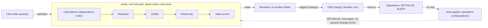

<PageBadges />

import { Callout } from "zudoku/ui/Callout"

Il motore non tiene traccia di quali campi vengono influenzati da una modifica. Ogni volta che
qualcosa cambia, esegue un passaggio di valutazione completo su tutto il modulo, sempre nello stesso
ordine. Conoscere questo ordine spiega gran parte di ciò che si vede durante l'esecuzione: perché un
campo calcolato può controllare la visibilità, perché un campo nascosto conta ancora in un calcolo e
quando vengono eseguiti i gestori di eventi.

## Creare un motore

`createFormEngine({ schema, initialValues })` prepara il modulo una sola volta:

1. Valida lo schema e genera un errore se non è valido. Vedi
   [Validazione dello schema](/it/core/schema/validation).
2. Imposta i valori: prima gli `initialValues` che passi, poi il `default_value` di ogni altro campo.
3. Determina da quali campi dipende ogni campo calcolato. Questo avviene una sola volta, non a ogni
   valutazione.
4. Esegue `form.events.code` una volta per registrare i gestori di eventi. In questa fase non viene
   attivato alcun evento.

La creazione del motore non valuta il modulo. Visibilità, obbligatorietà ed errori restano vuoti
fino alla prima chiamata a `engine.eval()`. I binding ufficiali la eseguono subito dopo aver creato
il motore.

## Un passaggio di valutazione

`engine.eval()` esegue questi passaggi in ordine, ogni volta:

<EngineDiagram name="evaluation-cycle">



</EngineDiagram>

| Passaggio         | Cosa succede                                                                                            | Risultato nello stato |
| ----------------- | ------------------------------------------------------------------------------------------------------- | --------------------- |
| 1. Calcoli        | Ogni `CalculatedField` esegue la propria espressione `calculate`, prima le dipendenze                   | `values`              |
| 2. Obbligatorietà | Viene verificato `required_conditions`, oppure si usa il flag statico `required`                        | `required`            |
| 3. Visibilità     | Viene verificato `visible_conditions`, oppure si usa il flag statico `visible`                          | `visible`             |
| 4. Sola lettura   | Viene verificato `read_only_conditions`, oppure si usa il flag statico `read_only`                      | `read_only`           |
| 5. Validazione    | Il valore di ogni campo viene controllato secondo le sue regole, come `pattern` o l'intervallo numerico | `errors`              |

Dopo il passaggio, `engine.getState()` restituisce il risultato. Gli stessi valori producono sempre
lo stesso stato, indipendentemente dall'ordine in cui l'utente li ha inseriti.

### Cosa significa l'ordine per il tuo schema

- **Le condizioni vedono i valori calcolati.** I calcoli vengono eseguiti per primi, quindi un
  `visible_conditions` o un `required_conditions` può fare riferimento a un `CalculatedField` e
  ottiene sempre il suo valore corrente.
- **I calcoli ignorano la visibilità.** Nascondere un campo non ne cancella il valore. Il valore di
  un campo nascosto resta in `values` e continua a contare in ogni calcolo che lo usa.
- **La validazione copre tutti i campi.** Gli errori di valore vengono calcolati anche per i campi
  nascosti. Un campo obbligatorio vuoto non è un errore in `errors`: è il renderer o la tua
  applicazione a decidere se blocca l'invio. Vedi
  [Campi obbligatori e invio](/it/core/schema/validation).
- **Le condizioni sui campi a scelta confrontano i valori selezionati.** Una condizione su un campo a
  scelta confronta il `value` della scelta selezionata, non l'intero oggetto memorizzato. Vedi
  [Condizioni e operatori](/it/core/schema/conditions-operators).

### Le sezioni seguono i propri figli

La visibilità viene valutata partendo dai campi più interni verso l'esterno. Una `Section` o una
`RepeatableSection` i cui figli sono tutti nascosti viene nascosta anch'essa, qualunque cosa dicano
i suoi `visible` o `visible_conditions`. Se almeno un figlio è visibile, valgono le impostazioni
della sezione.

## Quando un valore cambia

Il motore non ha un passaggio di "aggiornamento" separato. Quando un utente modifica un campo, i
binding ufficiali:

1. Scrivono il nuovo valore nei valori del motore.
2. Eseguono `engine.eval()`, che ripete l'intero passaggio descritto sopra.
3. Pubblicano il nuovo stato nell'interfaccia.
4. Attivano `change` per il campo modificato, eseguendo ogni gestore `ON("change", ...)`
   corrispondente.

I gestori di eventi non modificano mai direttamente il modulo. Restituiscono un elenco di operazioni,
come `SETVALUE` o `ALERT`, e l'host le applica. Quando l'host applica un `SETVALUE`, scrive il
valore ed esegue di nuovo `eval()`, ma non attiva un altro evento `change`. Per questo un gestore
non può avviare una catena di eventi di modifica impostando altri campi.

<Callout type="info" title="Supporto degli eventi nei binding">
  form0-core definisce un vocabolario di eventi più ampio, che comprende eventi di record, di campo
  e di sezione ripetibile. I renderer ufficiali attualmente attivano gli eventi portabili del ciclo
  di vita `load-record`, `edit-record` e `change`. Gli altri eventi non vengono attivati
  automaticamente perché la loro tempistica dipende dal flusso e dall'interfaccia dell'applicazione
  host. Le applicazioni possono attivarli esplicitamente con `engine.trigger(...)`. L'attivazione
  automatica di altri eventi può essere valutata caso per caso, ma gli schemi dovrebbero dipendere
  solo dagli eventi documentati dal proprio host o binding. Vedi [Attivazione degli eventi nei
  binding ufficiali](/it/core/builtins/events-overview).
</Callout>

## Usare il motore senza un renderer

Se gestisci il motore direttamente, segui la stessa sequenza usata dai binding:

```js
import { createFormEngine } from "form0-core"

const engine = createFormEngine({ schema, initialValues: { quantity: 2 } })
engine.eval()

// When the user changes a value:
engine.getState().values.quantity = 3
engine.eval()

// Then dispatch the change event and apply the operations it returns.
const operations = engine.trigger("change", "quantity")
```

<Callout type="caution" title="I campi a scelta usano le forme dei valori a runtime">
  `initialValues` e le scritture dirette in `engine.getState().values` devono usare la forma dei
  valori a runtime del motore. Ad esempio, un `SingleChoiceField` o un `BooleanField` usa
  `{ "choice": [{ "value": "it", "label": "Italy" }], "other": [] }`, mentre un `MultiChoiceField`
  usa `choices` al posto di `choice`. Questa forma è diversa dal `default_value` scalare o array di
  un campo a scelta nello schema. I componenti di campo dei renderer ufficiali producono queste
  forme; form0-core attualmente non offre un metodo pubblico per impostare e normalizzare i valori.
</Callout>

La tua applicazione è responsabile di applicare le operazioni restituite e di decidere quando un
campo obbligatorio vuoto blocca l'invio.
