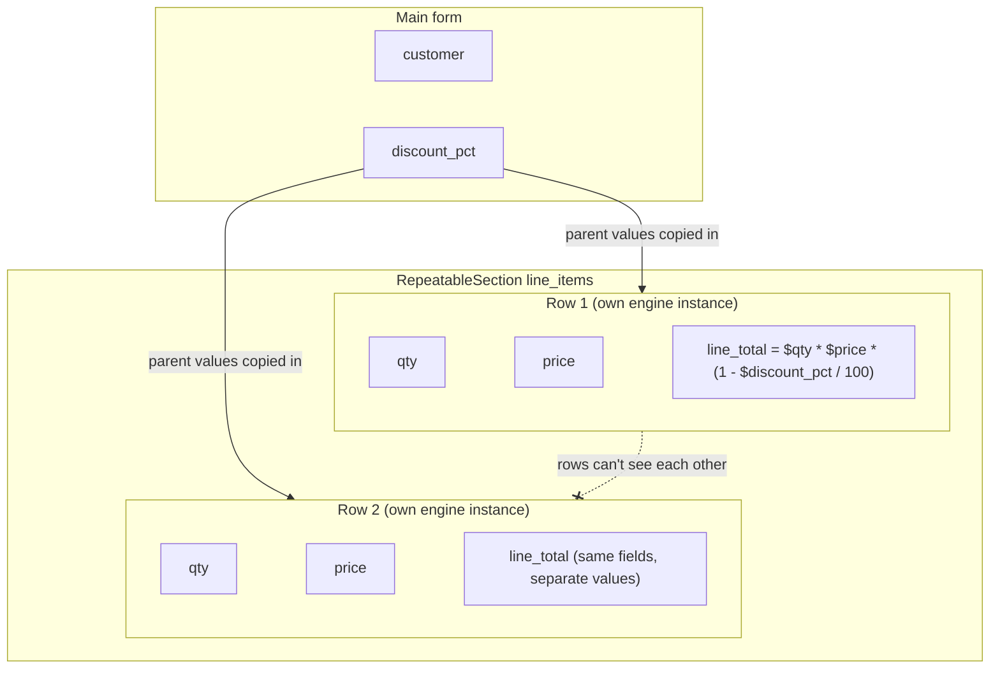

<PageBadges />

Una `RepeatableSection` permette all'utente di aggiungere un numero qualsiasi di righe, come le voci
di un ordine. Ogni riga contiene i propri valori per lo stesso insieme di campi. Questa pagina spiega
come vengono valutate le righe e quali campi un'espressione può leggere dal modulo principale e da
una riga.

## Come vengono valutate le righe

Nei renderer ufficiali React e React Native, il modulo principale viene valutato da un motore. Ogni
riga viene valutata in un'istanza di motore separata quando viene aperta. Il motore della riga usa
lo stesso schema e parte da una copia dei valori di tutto ciò che la contiene, più i valori propri
della riga:

- una riga in una `RepeatableSection` di primo livello riceve i valori del modulo principale;
- una riga in una `RepeatableSection` annidata riceve anche i valori della riga che la contiene.

Ogni riga ha quindi i propri `values`, `visible`, `required`, `read_only` ed `errors`. Due righe non
condividono mai lo stato, anche se usano gli stessi campi.

Se usi `form0-core` senza un renderer ufficiale, il core non crea i motori delle righe al posto tuo.
La tua applicazione deve creare un motore per ogni valutazione di riga e fornire i valori pertinenti
del modulo principale, delle righe antenate e della riga corrente.

<EngineDiagram name="repeatable-scope">

</EngineDiagram>

## Cosa può leggere un'espressione

Il punto in cui un'espressione è definita determina quali campi può leggere:

| Definita su                           | Campi del modulo principale | Campi della stessa riga | Campi delle righe che la contengono | Campi di altre righe |
| ------------------------------------- | --------------------------- | ----------------------- | ----------------------------------- | -------------------- |
| Un campo del modulo principale        | Sì                          | Non applicabile         | Non applicabile                     | No                   |
| Un campo in una riga di primo livello | Sì                          | Sì                      | Non applicabile                     | No                   |
| Un campo in una riga annidata         | Sì                          | Sì                      | Sì                                  | No                   |

Nell'esempio dell'ordine, `line_total` in ogni riga può usare `$discount_pct` dal modulo principale
e `$qty` e `$price` dalla propria riga. Un campo calcolato del modulo principale non può leggere
direttamente `$line_total`, perché ogni riga ha il proprio valore.

I calcoli e i gestori di eventi di campo seguono queste regole di accesso. Un riferimento di un
calcolo fuori dai campi consentiti legge `undefined` e il motore segnala un avviso come
`Field 'line_total' is not accessible from current context`.

Le condizioni vengono valutate sui valori disponibili nel motore corrente. In un editor di riga
ufficiale, questi comprendono il modulo principale, le righe antenate e la riga corrente. Le
condizioni non dovrebbero fare riferimento a campi di un altro ramo ripetibile. Il core attualmente
non segnala avvisi di accesso fuori ambito per i riferimenti nelle condizioni.

## I valori del padre sono una copia

Una riga legge i valori del padre che sono stati copiati nel suo motore. I renderer ufficiali copiano
i valori correnti del padre ogni volta che una riga viene aperta. Modificare in seguito un valore del
padre non ricalcola le altre righe: ognuna mantiene i valori calcolati dell'ultima valutazione,
finché non viene riaperta.

## Eventi e righe

I renderer ufficiali attivano `load-record`, `edit-record` e `change` solo per il record principale.
Aprire o modificare una riga non attiva alcun evento, quindi non riesegue i gestori del record
principale.

form0-core riconosce nomi di eventi del ciclo di vita dei ripetibili come `new-repeatable` e
`save-repeatable`, ma i binding ufficiali non ne definiscono ancora la tempistica portabile, i
metadati della riga o l'ambito legato all'istanza. Un'applicazione che li attiva direttamente deve
per ora definire da sé questo contratto. Vedi
[Attivazione degli eventi nei binding ufficiali](/it/core/builtins/events-overview).

Gli eventi di record, come `load-record`, possono leggere solo i campi del modulo principale. Gli
eventi di campo, come `change`, seguono le stesse regole di un calcolo definito sul campo che li ha
attivati.

## Le righe nel record di output

Quando il modulo viene inviato, ogni riga diventa un record figlio del record principale. Vedi
[Output e record](/it/core/output-records).
